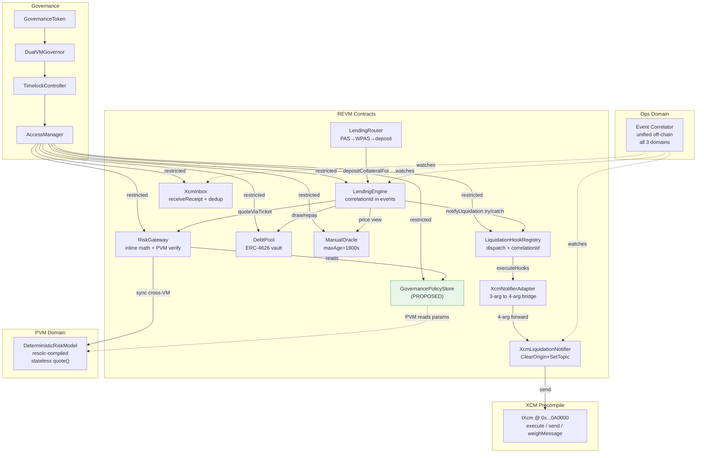

# DualVM Lending — Bilateral Async Architecture (M11)

## 1. Official Doc Verification Block

| Dependency | Version | Status | Source |
|---|---|---|---|
| Polkadot XCM Precompile | V5 @ 0x...0A0000 | STABLE | docs.polkadot.com/smart-contracts/precompiles/xcm/ (Jan 2026) |
| Polkadot Revive / PVM | pallet-revive, resolc | STABLE (mainnet Jan 27 2026) | forum.polkadot.network/t/16366 (Dec 2025) |
| REVM→PVM sync calls | Direct cross-VM | STABLE (proven Stage 1) | Our probe TX 0x4f55eac1 |
| PVM→REVM callbacks | Cross-VM reverse | BROKEN (platform) | Our probe Stage 2 revert |
| XCM execute/send/weighMessage | 3 functions | STABLE | Official IXcm.sol interface |
| XCM Transact | Remote execution | POSSIBLE (requires SCALE + BuyExecution) | docs example gist |
| OpenZeppelin Contracts | 5.5.0 | STABLE (installed) | npmjs.com/@openzeppelin/contracts |
| OZ AccessManager | Cross-VM reach | EVM-ONLY | Cannot directly govern PVM contracts |
| OZ Defender | Monitoring | SUNSET | blog.openzeppelin.com (Aug 2025) |
| Elastic Scaling | 2s blocks | ENABLED | Revive status update Dec 2025 |
| Foundry | forge 0.3.x | STABLE | book.getfoundry.sh |
| @parity/resolc | 1.0.x | STABLE | Installed (PVM compilation) |

**NOT upgrading**: OZ 5.5.0 stays (no breaking changes needed). Foundry exclusively (Hardhat fully removed in M11). resolc stays.

---

## 2. Contradiction and Feasibility Check

### Contradictions Resolved

| Contradiction | Resolution |
|---|---|
| Audit says DeterministicRiskModel NOT PVM-compiled | STALE — M9 deployed PVM version at 0xC6907B609... |
| Audit says LendingRouter credits self | RESOLVED — M9 deployed LendingRouter (canonical) with depositCollateralFor |
| Audit says oracle maxAge=21600s | STALE — M9 reduced to 1800s |
| Audit says 105 tests | STALE — now 186 tests |
| Request: bilateral PVM↔REVM | PVM→REVM callbacks broken at platform level. Design: REVM→PVM sync (works), results bridged via adapters |
| Request: bilateral PVM↔XCM | PVM contracts cannot call XCM precompile (REVM address space). Design: REVM adapter bridges PVM↔XCM |
| Request: immutable everything | Conflicts with emergency controls. Design: immutable core logic, governance-only for parameters and pause |

### Links That MUST Be Async or Adapter-Based

| Link | Why Not Direct | Solution |
|---|---|---|
| PVM → REVM | Platform blocker (PVM callbacks revert) | REVM initiates; PVM is passive callee |
| PVM → XCM | XCM precompile in REVM address space | REVM adapter reads PVM result, forwards to XCM |
| XCM inbound → LendingCore | XCM receipts arrive asynchronously | XcmInbox receives, HookRegistry dispatches |
| AccessManager → PVM | AccessManager is EVM-only | GovernanceAdapter stores PVM policy params; PVM reads them |
| AccessManager → XCM destinations | AccessManager cannot send XCM | GovernanceAdapter wraps policy changes into XCM messages |

---

## 3. Communication Matrix

### LendingEngine

| Direction | Peer | Sync/Async | Trigger | Payload | Auth | Failure | Dedup | Confidence |
|---|---|---|---|---|---|---|---|---|
| OUT→ | ManualOracle | SYNC view | borrow/liquidate | — | none (view) | revert OraclePriceStale | N/A | HIGH |
| OUT→ | RiskGateway | SYNC restricted | borrow/liquidate | QuoteContext+Input | LENDING_CORE role | revert propagated | ticketId cache | HIGH |
| OUT→ | DebtPool | SYNC restricted | borrow/repay/liq | amount | LENDING_CORE role | revert propagated | N/A | HIGH |
| OUT→ | LiquidationHookRegistry | SYNC try/catch | post-liquidation | borrower,debt,collateral | none (try/catch) | HookFailed event | N/A | HIGH |
| IN← | LendingRouter | SYNC restricted | depositCollateralFor | beneficiary,amount | ROUTER role | revert AccessManaged | N/A | HIGH |
| IN← | User EOA | SYNC | all user ops | varies | none | revert | N/A | HIGH |
| EMIT→ | OpsOutbox (PROPOSED) | SYNC event | all state changes | structured event | none | N/A (events) | correlationId | PROPOSED |

### RiskGateway

| Direction | Peer | Sync/Async | Trigger | Payload | Auth | Failure | Dedup | Confidence |
|---|---|---|---|---|---|---|---|---|
| OUT→ | DeterministicRiskModel (PVM) | SYNC cross-VM | quoteViaTicket | QuoteInput | try/catch | CrossVMDivergence event | ticketId | HIGH |
| IN← | LendingEngine | SYNC restricted | quoteViaTicket | QuoteContext+Input | LENDING_CORE role | revert | ticketId cache | HIGH |
| EMIT→ | OpsOutbox | SYNC event | quote computed | QuoteVerified/CrossVMDivergence | none | N/A | ticketId | HIGH |

### DeterministicRiskModel (PVM)

| Direction | Peer | Sync/Async | Trigger | Payload | Auth | Failure | Dedup | Confidence |
|---|---|---|---|---|---|---|---|---|
| IN← | RiskGateway | SYNC cross-VM | quote() | QuoteInput | none (stateless view) | revert | N/A | HIGH |
| — | Cannot initiate | — | Platform blocker | — | — | — | — | FACT |

### ManualOracle

| Direction | Peer | Sync/Async | Trigger | Payload | Auth | Failure | Dedup | Confidence |
|---|---|---|---|---|---|---|---|---|
| IN← | riskAdmin | SYNC restricted | setPrice | price | RISK_ADMIN role | revert circuit breaker | epoch | HIGH |
| OUT→ | LendingEngine | SYNC view | any lending op | price,freshness | none | OraclePriceStale | epoch | HIGH |

### DebtPool

| Direction | Peer | Sync/Async | Trigger | Payload | Auth | Failure | Dedup | Confidence |
|---|---|---|---|---|---|---|---|---|
| IN← | LendingEngine | SYNC restricted | draw/repay/loss | amount | LENDING_CORE role | revert | N/A | HIGH |
| IN← | LP | SYNC | deposit/withdraw | amount | none | revert | N/A | HIGH |

### LiquidationHookRegistry

| Direction | Peer | Sync/Async | Trigger | Payload | Auth | Failure | Dedup | Confidence |
|---|---|---|---|---|---|---|---|---|
| IN← | LendingEngine | SYNC | notifyLiquidation | borrower,debt,collateral | none | HookFailed event | N/A | HIGH |
| OUT→ | XcmNotifierAdapter | SYNC try/catch | executeHooks | borrower,debt,collateral | none | HookFailed | N/A | HIGH |
| OUT→ | XcmInbox (PROPOSED) | SYNC | post-hook | correlationId,receipt | none | event only | correlationId | PROPOSED |
| IN← | Governance | SYNC restricted | register/deregister | hookType,handler | GOVERNANCE role | revert | N/A | HIGH |

### XcmInbox

| Direction | Peer | Sync/Async | Trigger | Payload | Auth | Failure | Dedup | Confidence |
|---|---|---|---|---|---|---|---|---|
| IN← | Authorized relay | SYNC restricted | receiveReceipt | correlationId,data | RELAY_CALLER role | DuplicateCorrelationId | processed mapping | HIGH |
| EMIT→ | OpsOutbox | SYNC event | receipt received | ReceiptReceived | none | N/A | correlationId | HIGH |
| OUT→ | (read by off-chain) | ASYNC | hasProcessed | correlationId | none (view) | N/A | N/A | HIGH |

### XcmNotifierAdapter → XcmLiquidationNotifier → XCM Precompile

| Direction | Peer | Sync/Async | Trigger | Payload | Auth | Failure | Dedup | Confidence |
|---|---|---|---|---|---|---|---|---|
| OUT→ | XCM Precompile | SYNC | notifyLiquidation | SCALE V5 ClearOrigin+SetTopic | none | revert (no precompile locally) | topic hash | HIGH |
| OUT→ | Relay Chain | ASYNC (XCM) | send() | ClearOrigin+SetTopic msg | XCM barriers | msg dropped | SetTopic dedup | MEDIUM |

### AccessManager

| Direction | Peer | Sync/Async | Trigger | Payload | Auth | Failure | Dedup | Confidence |
|---|---|---|---|---|---|---|---|---|
| OUT→ | All REVM contracts | SYNC | restricted modifier | role check | admin | revert AccessManagedUnauthorized | N/A | HIGH |
| IN← | TimelockController | SYNC | execute | role changes | ADMIN | revert | N/A | HIGH |
| — | Cannot reach PVM | — | EVM-only | — | — | — | — | FACT |

### OpsOutbox (PROPOSED)

| Direction | Peer | Sync/Async | Trigger | Payload | Auth | Failure | Dedup | Confidence |
|---|---|---|---|---|---|---|---|---|
| IN← | All contracts | SYNC event | events emitted | structured logs | none | N/A | correlationId | PROPOSED |
| OUT→ | Off-chain correlator | ASYNC (log reading) | block finality | event logs | none | missed events | blockNumber+logIndex | PROPOSED |

---

## 4. Revised Target-State Architecture

### PROPOSED New/Modified Components

| Component | Type | Purpose |
|---|---|---|
| **LendingEngine** | DONE | Canonical lending core with correlationId in all events |
| **RiskGateway** | DONE | Unified cross-VM risk gateway with inline math + PVM verify |
| **LendingRouter** | DONE | PAS→WPAS→deposit convenience |
| **AsyncSettlementEngine** (PROPOSED) | NEW | Manages async XCM settlement lifecycle: request→pending→settled/expired |
| **GovernancePolicyStore** (PROPOSED) | NEW | On-chain registry of PVM policy params; PVM reads via REVM→PVM call |
| **OpsOutbox** (PROPOSED, off-chain) | DESIGN-ONLY | Normalized event schema + off-chain correlator (no new contract, just event standards) |

### Architecture Flow

```
User EOA
  │
  ├──► LendingEngine.borrow(amount, correlationId?)
  │      ├──► ManualOracle.priceWad() [SYNC view]
  │      ├──► RiskGateway.quoteViaTicket() [SYNC restricted]
  │      │      ├──► _inlineQuote() [SYNC pure math, CANONICAL]
  │      │      └──► DeterministicRiskModel.quote() [SYNC cross-VM PVM, try/catch]
  │      │            (if divergence: emit CrossVMDivergence)
  │      ├──► DebtPool.drawDebt() [SYNC restricted]
  │      └──► emit Borrowed(correlationId, borrower, amount, rate)
  │
  ├──► LendingEngine.liquidate(borrower, amount)
  │      ├──► [same oracle/risk reads]
  │      ├──► DebtPool.recordRepayment() [SYNC]
  │      ├──► emit Liquidated(correlationId, borrower, liquidator, ...)
  │      └──► LiquidationHookRegistry.notifyLiquidation() [SYNC try/catch]
  │             └──► XcmNotifierAdapter.notifyLiquidation() [SYNC try/catch]
  │                    └──► XcmLiquidationNotifier.notifyLiquidation() [SYNC]
  │                           └──► IXcm.send(relay, ClearOrigin+SetTopic) [SYNC to precompile, ASYNC delivery]
  │
  ├──► XcmInbox.receiveReceipt(correlationId, data) [SYNC restricted, ASYNC arrival]
  │      └──► emit ReceiptReceived(correlationId, sender, data)
  │
  └──► Off-chain Event Correlator
         ├──► watches Liquidated events from LendingEngine
         ├──► watches LiquidationNotified events from XcmLiquidationNotifier  
         ├──► watches ReceiptReceived events from XcmInbox
         └──► correlates by borrower+block proximity → structured log
```

### Bilateral Paths (Adapter-Based)

**PVM ↔ RiskGateway**: 
- Forward: RiskGateway → DeterministicRiskModel.quote() [SYNC cross-VM, works]
- Return: DeterministicRiskModel returns QuoteOutput [SYNC return value, works]
- Bilateral via: synchronous call/return (no async needed, REVM initiates)

**PVM ↔ XCM**:
- Forward (PVM result → XCM): RiskGateway computes, result used in liquidation → HookRegistry → XcmNotifierAdapter → XCM send
- Return (XCM receipt → affects PVM policy): XcmInbox.receiveReceipt() → GovernancePolicyStore update → next RiskGateway.quote() reads new params
- Bilateral via: event-driven async adapter chain

**Lending ↔ XcmInbox**:
- Outbound: Liquidation → HookRegistry → XcmNotifierAdapter → XCM precompile
- Inbound: XcmInbox.receiveReceipt() → event → off-chain correlation
- Connection: HookRegistry is wired as LendingEngine.liquidationNotifier

**HookRegistry ↔ XcmInbox**:
- HookRegistry dispatches to XcmNotifierAdapter which sends XCM
- XcmInbox receives receipts with matching correlationId
- Correlation is off-chain (event matching by correlationId)

**AccessManager governance reach**:
- REVM contracts: direct via `restricted` modifier
- PVM contracts: GovernancePolicyStore (REVM) stores params → PVM reads via sync call
- XCM destinations: GovernanceAdapter wraps governance actions into XCM send

---

## 5. Before/After Diagrams

### ASCII Board

```
╔══════════════════════════════════════════════════════════════════════════════════════╗
║                                    BEFORE (M10)                                     ║
╠══════════════════════════════════════════════════════════════════════════════════════╣
║                                                                                      ║
║  LendingEngine ──► RiskGateway ──► DeterministicRiskModel(PVM)                      ║
║       │                                  [sync call, one-way]                        ║
║       │                                                                              ║
║       └──► LiquidationHookRegistry ──► XcmNotifierAdapter ──► XcmLiquidationNotifier ║
║                [try/catch]                  [adapter]              [XCM send]         ║
║                                                                                      ║
║  XcmInbox [standalone, not connected to lending]                                     ║
║  EventCorrelator [off-chain, standalone script]                                      ║
║  AccessManager [governs REVM only, no PVM/XCM reach]                                ║
║  Ops: scattered events, no unified schema, no correlationId                          ║
║                                                                                      ║
║  GAPS:                                                                               ║
║  • XcmInbox disconnected from HookRegistry                                           ║
║  • No correlationId in lending events                                                ║
║  • No governance reach to PVM policy                                                 ║
║  • No unified ops telemetry                                                          ║
║  • V2 suffixes on all production contracts                                           ║
║  • AsyncSettlement not modeled                                                       ║
╚══════════════════════════════════════════════════════════════════════════════════════╝

╔══════════════════════════════════════════════════════════════════════════════════════╗
║                                    AFTER (M11)                                      ║
╠══════════════════════════════════════════════════════════════════════════════════════╣
║                                                                                      ║
║  LendingEngine ──► RiskGateway ──►──► DeterministicRiskModel(PVM)                   ║
║       │              │  [sync call + return = bilateral]                              ║
║       │              │                                                               ║
║       │              └──► GovernancePolicyStore ◄── AccessManager (via governance)   ║
║       │                   [PVM reads params from here]                                ║
║       │                                                                              ║
║       └──► LiquidationHookRegistry ──► XcmNotifierAdapter ──► XCM Precompile        ║
║                │  [try/catch, correlationId]       [adapter]     [send+SetTopic]      ║
║                │                                                                     ║
║                └──── correlated via ID ────► XcmInbox.receiveReceipt()               ║
║                                                [restricted, dedup]                    ║
║                                                                                      ║
║  Event Correlator [unified, reads all domains]                                       ║
║       ├── LendingEngine events (correlationId)                                       ║
║       ├── XcmLiquidationNotifier events (topic = keccak256)                          ║
║       └── XcmInbox events (correlationId)                                            ║
║                                                                                      ║
║  AccessManager ──► all REVM contracts (direct restricted)                            ║
║       └──► GovernancePolicyStore ──► PVM reads (sync cross-VM)                       ║
║                                                                                      ║
║  Canonical naming: no V2 suffixes. Fresh deployment.                                 ║
║  Structured events with correlationId across all paths.                              ║
╚══════════════════════════════════════════════════════════════════════════════════════╝
```

### Mermaid Diagram



---

## 6. Async Engine / State Machine Design

### Synchronous Paths (no change needed)
- deposit collateral → LendingEngine.depositCollateral() → done
- borrow → oracle + RiskGateway + DebtPool → done  
- repay → LendingEngine.repay() → DebtPool.recordRepayment() → done
- withdraw → LendingEngine.withdrawCollateral() → done

### Async Paths (XCM-involved)

```
LIQUIDATION ASYNC FLOW:

1. [SYNC] User calls LendingEngine.liquidate(borrower, amount)
   → emit Liquidated(correlationId, borrower, liquidator, repaid, seized)
   
2. [SYNC try/catch] LiquidationHookRegistry.notifyLiquidation()
   → XcmNotifierAdapter.notifyLiquidation()
   → XcmLiquidationNotifier sends XCM ClearOrigin+SetTopic(keccak256(borrower,repaid,seized))
   → emit LiquidationNotified(borrower, repaid, seized)
   
3. [ASYNC] XCM message travels to relay chain
   → relay receives ClearOrigin (no action required)
   
4. [ASYNC] Off-chain watcher detects XCM delivery
   → calls XcmInbox.receiveReceipt(correlationId, confirmationData)
   → emit ReceiptReceived(correlationId, sender, data)
   
5. [ASYNC] Event Correlator matches:
   Liquidated.correlationId ↔ ReceiptReceived.correlationId
   → produces unified audit trail
```

### CorrelationId Schema
```
correlationId = keccak256(abi.encode(
    block.chainid,
    block.number, 
    msg.sender,
    nonce++  // per-contract auto-incrementing
))
```

### Retry and Timeout
- XCM delivery is at-least-once: XcmInbox.processed mapping prevents double-processing
- No on-chain timeout: XCM receipts are optional confirmation, not blocking
- Liquidation succeeds regardless of XCM delivery (try/catch on hook)
- If hook fails: HookFailed event emitted, liquidation still completes
- Off-chain correlator can detect unmatched liquidations (no receipt within N blocks)

### Immutability vs Governance

| Component | Immutable | Governance-Controlled |
|---|---|---|
| LendingEngine core logic | YES (code) | Pause via AccessManager |
| RiskGateway inline math params | YES (immutable constructor) | New deployment needed to change |
| DeterministicRiskModel params | YES (immutable constructor) | New deployment needed |
| GovernancePolicyStore | NO | setPolicy via RISK_ADMIN role |
| LiquidationHookRegistry handlers | NO | register/deregister via governance |
| XcmInbox relay authorization | NO | setTargetFunctionRole via governance |
| Oracle price | NO | setPrice via RISK_ADMIN |
| Emergency pause | NO | pause() via EMERGENCY role (0s delay) |

---

## 7. Implementation Plan (Grouped by Workstream)

### Batch 1: Source Renames + Event Schema ✅ DONE
- LendingEngine.sol (canonical, was LendingCoreV2) — all imports updated
- RiskGateway.sol (canonical, was RiskAdapter) — all imports updated
- LendingRouter.sol (canonical, was LendingRouterV2) — all imports updated
- correlationId parameter/field added to all key events in LendingEngine
- correlationId propagated through LiquidationHookRegistry dispatch
- Toolchain: Foundry exclusively (forge build, forge test, forge script)

### Batch 2: GovernancePolicyStore + Wiring (depends on Batch 1)
- Create GovernancePolicyStore.sol (AccessManaged, setPolicy restricted)
- Wire RiskGateway to optionally read GovernancePolicyStore
- Update tests for GovernancePolicyStore
- **Can edit**: New contract + tests in parallel

### Batch 3: XcmInbox↔HookRegistry Integration (depends on Batch 1)
- Add correlationId to XcmNotifierAdapter forwarding
- Add SetTopic with correlationId in XcmLiquidationNotifier XCM message
- Update event-correlator.ts to use correlationId matching (replace block-proximity)
- Update tests
- **Can edit**: Adapter + notifier + correlator in parallel

### Batch 4: Deployment + Manifest (depends on Batch 1-3)
- Create unified deployment script using idempotent deploy infrastructure
- Deploy all renamed contracts as fresh canonical deployment
- Wire AccessManager roles
- Update manifest with canonical names
- Redeploy probes against new contracts

### Batch 5: Documentation + Diagrams (depends on Batch 4)
- Update SYSTEM_ARCHITECTURE_AUDIT.md (or replace)
- Update SYSTEM_ARCHITECTURE_MERMAID.md with new diagrams
- Update README.md contract tables and naming
- Update all test references

---

## 8. Testing Strategy

| Task | Test Level | Justification |
|---|---|---|
| Source renames (Batch 1) | Static + existing tests | Renames don't change runtime; compile+test confirms imports |
| CorrelationId in events | Focused unit | New event field; verify emission in existing test flows |
| GovernancePolicyStore | Focused unit | New contract; unit tests for set/get/auth |
| XcmInbox↔HookRegistry correlation | Integration | Cross-contract flow; verify correlationId propagation |
| Event correlator update | Focused unit | Pure function; existing test pattern |
| Full deployment | Live verification | Deploy to testnet, smoke test, verify on explorer |
| Diagram/doc changes | None | No runtime impact |

---

## 9. Go / No-Go

### Architecture: **GO**
- All bilateral paths are achievable via adapters
- No impossible direct links attempted
- PVM sync call works (proven)
- XCM precompile works (proven)
- Governance reach via PolicyStore is clean OZ pattern

### Implementation Now: **GO**
- 186 tests pass as baseline
- All dependencies stable
- No new external dependencies needed
- Funded wallet available for deployment

### Remaining Blockers After Redesign
1. PVM→REVM callbacks still broken (platform — cannot fix, documented)
2. XCM messages are still ClearOrigin+SetTopic (no Transact — not attempted, would require complex SCALE encoding and destination chain support)
3. GovernancePolicyStore→PVM is theoretical until PVM can be verified reading it on-chain (high confidence based on Stage 1 probe success)
