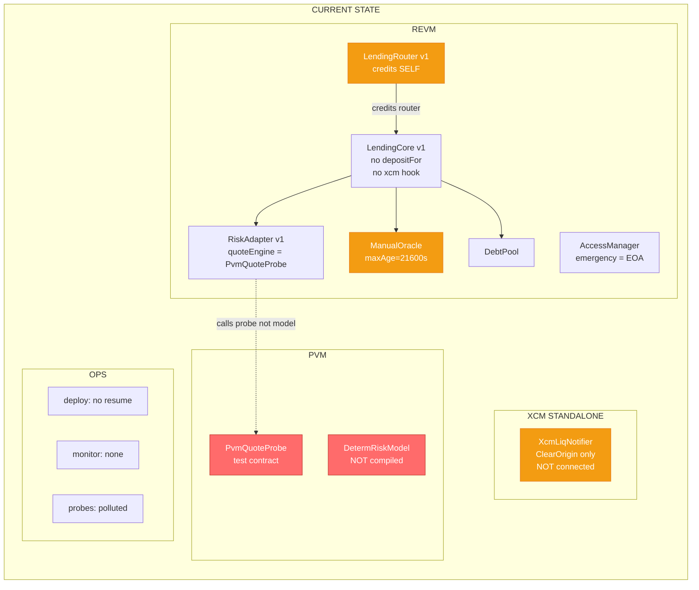
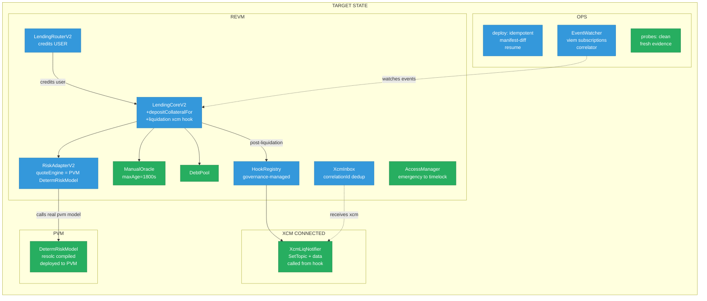

# before vs after mermaid

## before (current state)

```mermaid
graph LR
    subgraph BEFORE["CURRENT STATE"]
        direction TB
        subgraph B_REVM["REVM"]
            B_LC["LendingCore v1\nno depositFor\nno xcm hook"]
            B_RA["RiskAdapter v1\nquoteEngine = PvmQuoteProbe"]
            B_DP["DebtPool"]
            B_MO["ManualOracle\nmaxAge=21600s"]
            B_LR["LendingRouter v1\ncredits SELF"]
            B_AM["AccessManager\nemergency = EOA"]
        end
        subgraph B_XCM["XCM STANDALONE"]
            B_XN["XcmLiqNotifier\nClearOrigin only\nNOT connected"]
        end
        subgraph B_PVM["PVM"]
            B_PQ["PvmQuoteProbe\ntest contract"]
            B_DRM["DetermRiskModel\nNOT compiled"]
        end
        subgraph B_OPS["OPS"]
            B_DEP["deploy: no resume"]
            B_MON["monitor: none"]
            B_PRB["probes: polluted"]
        end
        B_LC --> B_RA
        B_RA -.->|"calls probe not model"| B_PQ
        B_LC --> B_MO
        B_LC --> B_DP
        B_LR -->|"credits router"| B_LC
    end

    classDef broken fill:#ff6b6b,stroke:#c0392b,color:#fff
    classDef warning fill:#f39c12,stroke:#e67e22,color:#fff
    class B_PQ broken
    class B_DRM broken
    class B_LR warning
    class B_MO warning
    class B_XN warning
```

## after (target state)

```mermaid
graph LR
    subgraph AFTER["TARGET STATE"]
        direction TB
        subgraph A_REVM["REVM"]
            A_LC["LendingCoreV2\n+depositCollateralFor\n+liquidation xcm hook"]
            A_RA["RiskAdapterV2\nquoteEngine = PVM DetermRiskModel"]
            A_DP["DebtPool"]
            A_MO["ManualOracle\nmaxAge=1800s"]
            A_LR["LendingRouterV2\ncredits USER"]
            A_AM["AccessManager\nemergency to timelock"]
            A_REG["HookRegistry\ngovernance-managed"]
            A_INB["XcmInbox\ncorrelationId dedup"]
        end
        subgraph A_XCM["XCM CONNECTED"]
            A_XN["XcmLiqNotifier\nSetTopic + data\ncalled from hook"]
        end
        subgraph A_PVM["PVM"]
            A_DRM["DetermRiskModel\nresolc compiled\ndeployed to PVM"]
        end
        subgraph A_OPS["OPS"]
            A_DEP["deploy: idempotent\nmanifest-diff\nresume"]
            A_MON["EventWatcher\nviem subscriptions\ncorrelator"]
            A_PRB["probes: clean\nfresh evidence"]
        end
        A_LC --> A_RA
        A_RA -->|"calls real pvm model"| A_DRM
        A_LC --> A_MO
        A_LC --> A_DP
        A_LC -->|"post-liquidation"| A_REG
        A_REG --> A_XN
        A_LR -->|"credits user"| A_LC
        A_INB -.->|"receives xcm"| A_XN
        A_MON -.->|"watches events"| A_LC
    end

    classDef good fill:#27ae60,stroke:#1e8449,color:#fff
    classDef proposed fill:#3498db,stroke:#2980b9,color:#fff
    classDef platform fill:#95a5a6,stroke:#7f8c8d,color:#fff
    class A_LC proposed
    class A_RA proposed
    class A_LR proposed
    class A_REG proposed
    class A_INB proposed
    class A_DRM good
    class A_DP good
    class A_MO good
    class A_AM good
    class A_XN good
    class A_DEP proposed
    class A_MON proposed
    class A_PRB good
```
