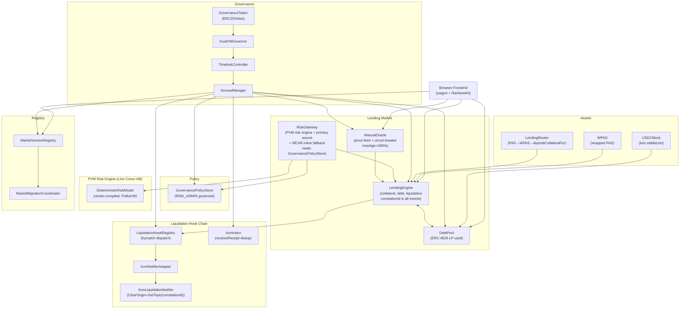
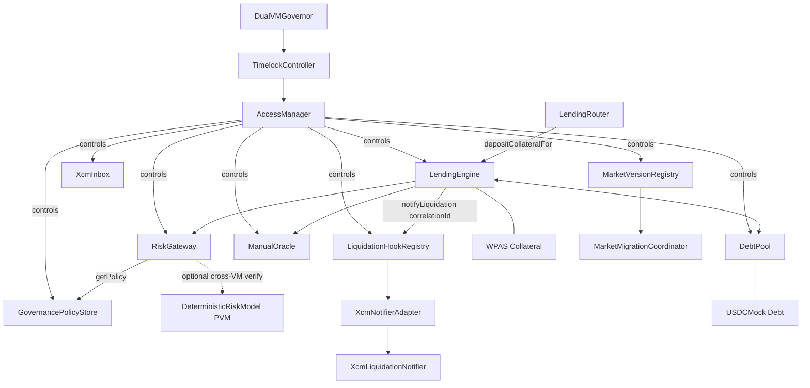
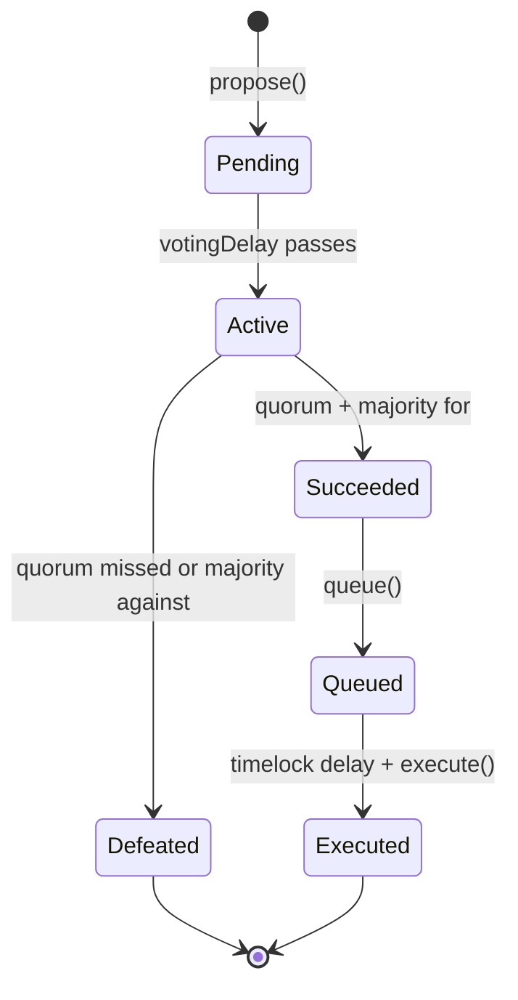
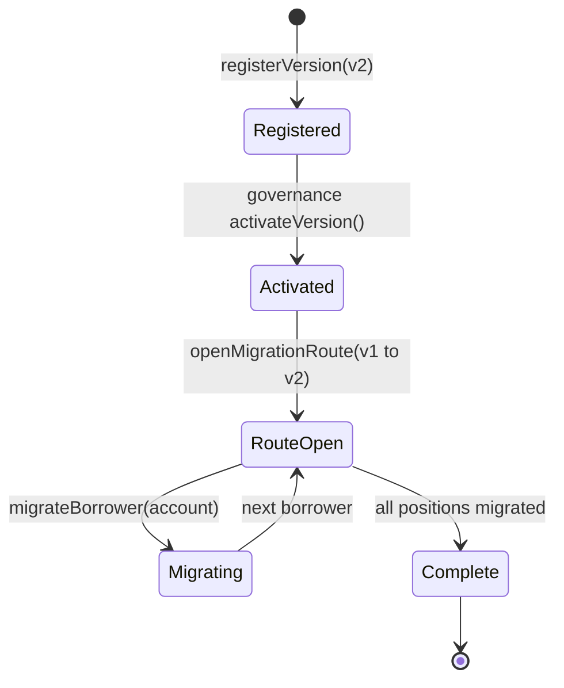
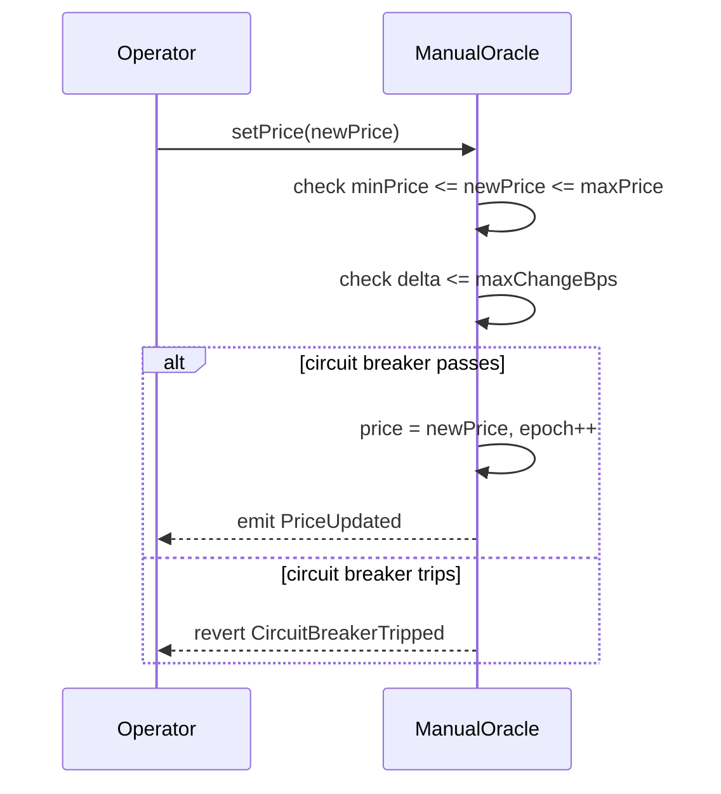
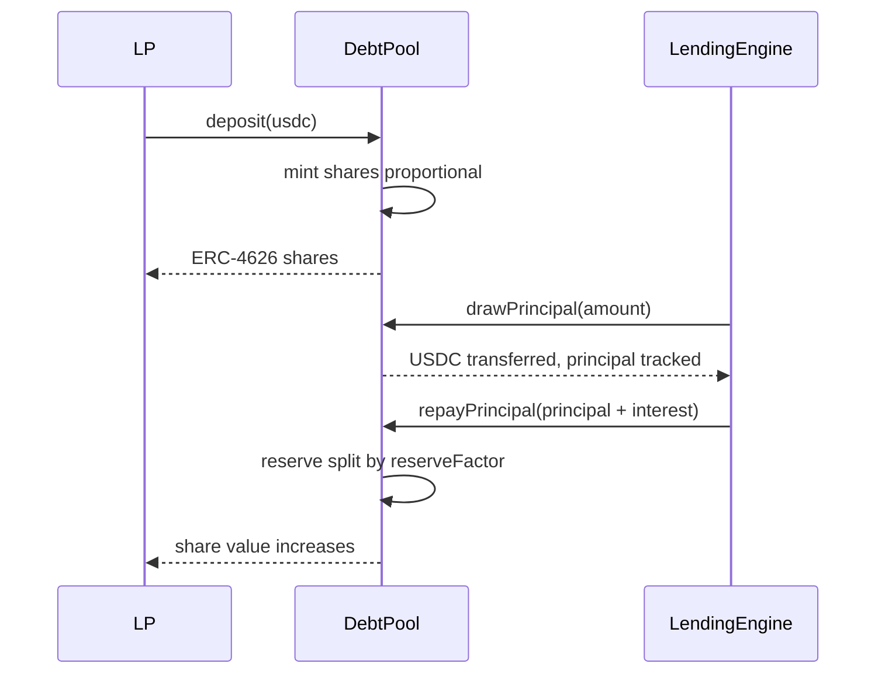
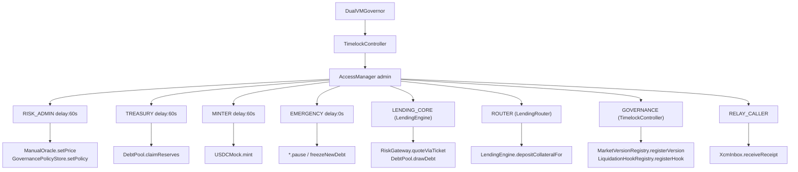
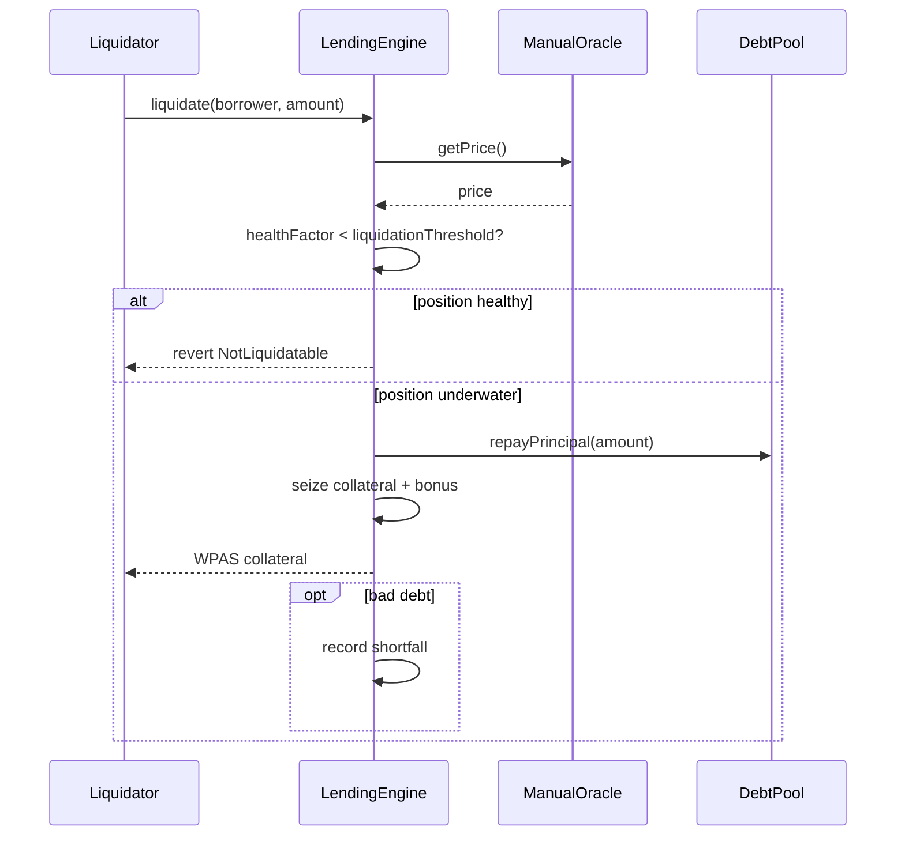

<!-- summary: dualvm lending is a production-minded isolated lending market built on polkadot hub testnet (chain id 420420417).
it combines solidity-based custody and accounting on the evm (revm) with a pvm-compiled deterministic risk engine, openzeppelin governor-based governance, and a full browser-based lending ui using wagmi and rainbowkit.

the protocol supports one collateral asset (wpas, wrapped native pas) and one debt asset (usdc-test, a team-controlled mock erc-20). lenders deposit usdc-test into an erc-4626 vault (debtpool). borrowers wrap pas into wpas, deposit as collateral into lendingengine, and draw usdc-test debt. repayment, liquidation, and collateral withdrawal are all available from the browser.

risk parameters (borrow rate, max ltv, liquidation threshold) are computed by riskgateway, which queries deterministicriskmodel (the pvm risk engine) as the primary computation source via an extended 7-field quoteinput carrying governance policy overrides. the pvm contract applies governance-aware risk logic (maxltv, liquidationthreshold, borrowratefloor overrides) and returns the canonical risk parameters. revm inline math serves as a deterministic fallback if the pvm call fails.

governance follows the openzeppelin governor→timelockcontroller→accessmanager chain. the timelock holds accessmanager admin. the deployer has no residual roles. role execution delays are non-zero for risk, treasury, and minter operations. market versions are registered and activated via governance proposals.

m11 bilateral-async-unified: all contracts freshly deployed with canonical names (lendingengine, riskgateway, lendingrouter, governancepolicystore). correlationid flows through all lending events into the xcm liquidation hook chain. xcminbox enables receipt correlation. foundry is the sole build/test/deploy toolchain (300 tests pass).

track 2 pvm-primary: pvm is the primary risk computation source. quoteinput extended with 3 governance policy fields (maxltvoverride, liquidationthresholdoverride, borrowrateflooroverride). xcm execute(clearorigin+settopic) proven on-chain. deterministicriskmodel deployed as real pvm bytecode at 0x1e6903a816be0bc013291bbed547df45bdc9e86c, riskgateway at 0x5c66f69a04f3a460b1fabf971b8b4d2d18141bd4.

all contracts are deployed on polkadot hub testnet and most are verified on blockscout. this is a hackathon mvp, not a production system. -->

# DualVM Lending

A production-minded, public-testnet-validated isolated lending market on **Polkadot Hub TestNet**. DualVM Lending combines Solidity-based custody and accounting on REVM with a live PVM-compiled risk engine, OpenZeppelin Governor-based governance, and a full browser-based lending UX.

Built for the [Polkadot Solidity Hackathon 2026](https://dorahacks.io/) — targeting **all 3 prize tracks** simultaneously.

## Live Network

| Field | Value |
|-------|-------|
| Network | Polkadot Hub TestNet |
| Chain ID | `420420417` |
| ETH RPC | `https://eth-rpc-testnet.polkadot.io/` |
| Fallback RPC | `https://services.polkadothub-rpc.com/testnet/` |
| Explorer | [Blockscout](https://blockscout-testnet.polkadot.io/) |
| Faucet | [Polkadot Faucet](https://faucet.polkadot.io/) (Network: Polkadot testnet Paseo, Chain: Hub smart contracts) |

## Live Frontend

| Hosting | URL |
|---------|-----|
| **Primary (Vercel)** | [https://dualvm-lending.vercel.app](https://dualvm-lending.vercel.app) |
| Backup (GitHub Pages) | [http://eyawa.me/dualvm-lending/](http://eyawa.me/dualvm-lending/) |

Connect your wallet (MetaMask or any injected wallet) to Polkadot Hub TestNet (chain ID 420420417) to deposit, borrow, repay, and liquidate directly from the browser.

## Architecture

The system spans EVM (REVM) and PVM (PolkaVM) execution environments with OpenZeppelin Governor governance. M11 introduces canonical contract names, correlationId-driven event flows, bilateral XCM adapter chain, and Foundry as the sole toolchain.

### System Overview



### Borrow Call Flow

```mermaid
sequenceDiagram
    participant U as User
    participant LE as LendingEngine
    participant MO as ManualOracle
    participant RG as RiskGateway
    participant GPS as GovernancePolicyStore
    participant DRM as DeterministicRiskModel (PVM)
    participant DP as DebtPool
    U->>LE: 1. borrow(amount)
    LE->>LE: correlationId = keccak256(chainid, block, sender, nonce++)
    LE->>MO: 2. getPrice()
    MO-->>LE: price, timestamp
    LE->>RG: 3. quoteViaTicket(context, input)
    Note over RG: 4. _inlineQuote() — canonical deterministic path
    RG->>GPS: 4a. getPolicy() [governance overrides, view]
    RG->>DRM: 4b. quoteEngine.quote(input) [PVM primary, governance-aware]
    DRM-->>RG: QuoteOutput (borrowRate, maxLtv, liqThreshold with policy applied)
    RG-->>LE: QuoteTicket (PVM result is authoritative; REVM inline is fallback)
    LE->>LE: 5. healthFactor >= threshold?
    LE->>DP: 6. drawDebt(amount)
    DP-->>U: 7. USDC-test tokens
    LE->>LE: emit Borrowed(correlationId, borrower, amount, rate)
```

### Contract Dependency Graph



### Governance Lifecycle



### Dual-VM Execution Boundary

```mermaid
graph LR
    subgraph EVM["EVM (REVM) — product contracts"]
        LE[LendingEngine]
        DP[DebtPool]
        MO[ManualOracle]
        RG["RiskGateway (inline math: canonical path)"]
        GPS[GovernancePolicyStore]
        HR[LiquidationHookRegistry]
        GV[Governor stack]
    end
    subgraph PVM["PVM (PolkaVM) — primary risk computation"]
        QE["DeterministicRiskModel (governance-aware)"]
    end
    RG -->|PVM result is authoritative| LE
    RG -->|primary: quoteEngine.quote(7-field input)| QE
    QE -->|risk params with governance overrides| RG
    GPS -->|policy params (maxLtv, liqThreshold, rateFloor)| RG
```

### Migration State Machine



### Oracle Update Flow



### ERC-4626 Pool Flow



### AccessManager Role Graph



### Liquidation Flow



### How PVM Interop Works

The PVM risk engine is the **primary risk computation source**, not optional verification. Here is the proof chain:

1. **DeterministicRiskModel** is the PVM risk engine. It accepts a 7-field `QuoteInput` struct including 3 governance policy override fields (`maxLtvOverride`, `liquidationThresholdOverride`, `borrowRateFloorOverride`). When policy fields are non-zero, it applies them — producing **different output** than without policy (e.g., maxLTV 7500→6000, liqThreshold 8500→8000). This is not "same math twice" — PVM carries governance-aware logic that REVM inline does not.
2. **RiskGateway** calls `quoteEngine.quote(input)` as the primary computation path. The REVM inline `_inlineQuote()` is the fallback, used only if PVM call fails (try/catch). GovernancePolicyStore feeds policy overrides into the QuoteInput.
3. **Track 2 on-chain verification** (6/6 tests pass):
   - **PVM Quote (no policy)**: ✅ Input `(5000,15000,60,true,0,0,0)` → `borrowRate=700, maxLtv=7500, liqThreshold=8500`
   - **PVM Quote (with policy)**: ✅ Input `(5000,15000,60,true,6000,8000,500)` → `borrowRate=700, maxLtv=6000, liqThreshold=8000` — governance overrides applied
   - **RiskGateway quoteEngine**: ✅ Returns DeterministicRiskModel address (`0x1e6903a816be0bc013291bbed547df45bdc9e86c`)
   - **XCM weighMessage**: ✅ `ClearOrigin+SetTopic` V5 → `refTime=1810000, proofSize=0`
   - **XCM execute**: ✅ TX `0xa05693ff...` at block 6595576, status: success
   - **executeLocalNotification**: ✅ TX `0xb35f468a...` at block 6595577, emits `LocalXcmExecuted(correlationId=0xff, refTime=1810000)`
4. **Legacy probe stages** (M9 era, still valid for REVM→PVM data integrity):
   - Stage 1A (Echo): ✅ | Stage 1B (Quote): ✅ | Stage 2 (PVM→REVM callback): ❌ platform limitation | Stage 3 (Roundtrip): ⚠️ accumulated state
5. **XCM execute()** proven on-chain: `ClearOrigin+SetTopic(correlationId)` V5 message executed via XCM precompile at `0x...0a0000`. TX hash `0xa05693ff...` at block 6595576. `executeLocalNotification()` end-to-end at block 6595577.
6. **Note**: DeterministicRiskModel is deployed as real PVM bytecode (compiled via `resolc`) at `0x1e6903a816be0bc013291bbed547df45bdc9e86c`. The architecture is PVM-primary — the PVM contract applies governance-aware risk overrides that the REVM inline fallback does not.

### Governance Architecture

The governance root follows the **Governor→TimelockController→AccessManager** pattern:

- **GovernanceToken**: ERC20 + ERC20Permit + ERC20Votes with timestamp-based CLOCK_MODE
- **DualVMGovernor**: Governor + GovernorCountingSimple + GovernorVotes + GovernorVotesQuorumFraction + GovernorTimelockControl
- **TimelockController**: Holds AccessManager admin role. Governor is the proposer.
- **AccessManager**: System-wide role management with non-zero execution delays (riskAdmin: 60s, treasury: 60s, minter: 60s, emergency: 0s)
- **Deployer has NO residual roles** — admin was renounced after setup.

Demo-friendly parameters: voting delay ~1s, voting period ~300s, timelock ~60s, quorum 4%.

## Failure Modes

| Failure Mode | Impact | Recovery |
|---|---|---|
| **Oracle Stale (>maxAge)** | Borrows revert with `OraclePriceStale`. Liquidations still work (last known price used for health factor). Repayments work. | Operator calls `setPrice()`. |
| **PVM Unavailable** | RiskGateway falls back to inline deterministic math (REVM). PVM is the primary risk computation source; fallback produces identical base results but does NOT apply governance policy overrides. `CrossVMDivergence` event emitted if PVM recovers with different parameters. | PVM contract redeploy or restore. Inline fallback keeps protocol operational but without governance-aware risk adjustments. |
| **Liquidity Exhausted** | Borrows fail with `InsufficientLiquidity`. LP withdrawals may fail if pool is dry. Repayments always work. Liquidations work (reduce debt without drawing new liquidity). | More LP deposits or borrowers repay. |
| **Circuit Breaker** | `setPrice()` reverts if price is outside `[minPriceWad, maxPriceWad]` or delta exceeds `maxChangeBps`. Protocol continues on last accepted price. | Operator adjusts circuit breaker params via governance proposal, then updates price. |
| **Emergency Procedures** | `EMERGENCY` role (delay=0) can call `pause()` on `LendingEngine`, `DebtPool`, and `ManualOracle`. `freezeNewDebt()` blocks new borrows while preserving repay/liquidate. | Resume via `unpause()` after root cause is resolved. |

## Market Configuration

### Risk Parameters

| Parameter | Value |
|-----------|-------|
| Max LTV | 70% (7000 bps) |
| Liquidation Threshold | 80% (8000 bps) |
| Liquidation Bonus | 5% (500 bps) |
| Reserve Factor | 10% (1000 bps) |
| Supply Cap | 5,000,000 USDC |
| Borrow Cap | 4,000,000 USDC |
| Min Borrow Amount | 100 USDC |
| Oracle Max Age | 30 minutes (1800s) — reduced from 6h in V2 |

### Interest Rate Model (Kinked)

| Parameter | Value |
|-----------|-------|
| Base Rate | 2% (200 bps) |
| Slope 1 (below kink) | 8% (800 bps) |
| Slope 2 (above kink) | 30% (3000 bps) |
| Kink Utilization | 80% (8000 bps) |

### OpenZeppelin Integration

Non-trivial composition of OZ 5.x contracts:

- **AccessManager** — System-wide role-function mapping with execution delays (riskAdmin: 60s, treasury: 60s, minter: 60s, emergency: 0s)
- **Governor** — Full propose/vote/queue/execute lifecycle (5 extensions composed)
- **TimelockController** — Governance timelock; holds AccessManager admin
- **ERC20Votes + ERC20Permit** — Governance token with on-chain delegation
- **ERC4626** — DebtPool LP vault with virtual-offset inflation-attack protection
- **SafeERC20** — All token transfers in LendingEngine
- **Pausable** — Emergency pause on core, pool, and oracle
- **ReentrancyGuard** — All state-changing fund flows

## Canonical Deployment (M11 — Bilateral Async Unified)

All contracts freshly deployed via `forge script` with canonical names under a single Governor→TimelockController→AccessManager governance root. Canonical manifest: `dualvm/deployments/polkadot-hub-testnet-m11-canonical.json`.

### Core Lending Contracts

| Contract | Address | Explorer |
|----------|---------|----------|
| AccessManager | `0xc126951a58644bd3d5e23c781263873c4305ccc8` | [Blockscout](https://blockscout-testnet.polkadot.io/address/0xc126951a58644bd3d5e23c781263873c4305ccc8) |
| WPAS (Collateral) | `0x5e18c7708d492c66d8ebd92ae208b74c069f18fc` | [Blockscout](https://blockscout-testnet.polkadot.io/address/0x5e18c7708d492c66d8ebd92ae208b74c069f18fc) |
| USDCMock (Debt) | `0x2d7e60571b478f8de5f25a8b494e7f4527310d34` | [Blockscout](https://blockscout-testnet.polkadot.io/address/0x2d7e60571b478f8de5f25a8b494e7f4527310d34) |
| ManualOracle | `0xfe5636f2b5be3f97a604958161030874e2e70810` | [Blockscout](https://blockscout-testnet.polkadot.io/address/0xfe5636f2b5be3f97a604958161030874e2e70810) |
| GovernancePolicyStore | `0x0c8c0c8e2180c90798822ab85de176fe4d8c86cf` | [Blockscout](https://blockscout-testnet.polkadot.io/address/0x0c8c0c8e2180c90798822ab85de176fe4d8c86cf) |
| RiskGateway | `0x5c66f69a04f3a460b1fabf971b8b4d2d18141bd4` | [Blockscout](https://blockscout-testnet.polkadot.io/address/0x5c66f69a04f3a460b1fabf971b8b4d2d18141bd4) |
| DeterministicRiskModel (PVM Risk Engine) | `0x1e6903a816be0bc013291bbed547df45bdc9e86c` | [Blockscout](https://blockscout-testnet.polkadot.io/address/0x1e6903a816be0bc013291bbed547df45bdc9e86c) |
| DebtPool (ERC-4626) | `0xff42db4e29de3ccb206162fe51bc38a0283f652b` | [Blockscout](https://blockscout-testnet.polkadot.io/address/0xff42db4e29de3ccb206162fe51bc38a0283f652b) |
| LendingEngine | `0x11bf643d87b3f754b0852ff5243e795815765e7d` | [Blockscout](https://blockscout-testnet.polkadot.io/address/0x11bf643d87b3f754b0852ff5243e795815765e7d) |
| LendingRouter | `0x1b86e0103702ae58000e77cd415e2a1299a0c59c` | [Blockscout](https://blockscout-testnet.polkadot.io/address/0x1b86e0103702ae58000e77cd415e2a1299a0c59c) |
| MarketVersionRegistry | `0x4860ff44679c964ef0294a1a3e9b1c12ac7ed658` | [Blockscout](https://blockscout-testnet.polkadot.io/address/0x4860ff44679c964ef0294a1a3e9b1c12ac7ed658) |
| MarketMigrationCoordinator | `0x8b1fdebf1fa3e97c8f327a34957a36dce287a936` | [Blockscout](https://blockscout-testnet.polkadot.io/address/0x8b1fdebf1fa3e97c8f327a34957a36dce287a936) |

### Bilateral Async Contracts (M11)

| Contract | Address | Explorer |
|----------|---------|----------|
| LiquidationHookRegistry | `0xddb390a3085bca224d4f514804bd831050e15130` | [Blockscout](https://blockscout-testnet.polkadot.io/address/0xddb390a3085bca224d4f514804bd831050e15130) |
| XcmNotifierAdapter | `0xb748020b0c17b7c6aa95b28d33d12ec98aab4640` | [Blockscout](https://blockscout-testnet.polkadot.io/address/0xb748020b0c17b7c6aa95b28d33d12ec98aab4640) |
| XcmLiquidationNotifier | `0x9ce976675c3a859f2ad57d7976e6363fda22e825` | [Blockscout](https://blockscout-testnet.polkadot.io/address/0x9ce976675c3a859f2ad57d7976e6363fda22e825) |
| XcmInbox | `0x37e09978b1e46e7cbe7920e7c1968aa03556ed3e` | [Blockscout](https://blockscout-testnet.polkadot.io/address/0x37e09978b1e46e7cbe7920e7c1968aa03556ed3e) |

### Governance Contracts (M11)

| Contract | Address | Explorer |
|----------|---------|----------|
| GovernanceToken (ERC20Votes) | `0xfb99fea8c91b10c2e1747a537ac8aa6ab68adf21` | [Blockscout](https://blockscout-testnet.polkadot.io/address/0xfb99fea8c91b10c2e1747a537ac8aa6ab68adf21) |
| DualVMGovernor | `0x27918831aac573f57e874999b983296226524856` | [Blockscout](https://blockscout-testnet.polkadot.io/address/0x27918831aac573f57e874999b983296226524856) |
| TimelockController | `0x7b8f6f367a7f30df1cdff3e635ff200a20352525` | [Blockscout](https://blockscout-testnet.polkadot.io/address/0x7b8f6f367a7f30df1cdff3e635ff200a20352525) |

### Track 2 Contracts (PVM-Primary Deployment)

| Contract | Address | Explorer |
|----------|---------|----------|
| DeterministicRiskModel (PVM Risk Engine) | `0x1e6903a816be0bc013291bbed547df45bdc9e86c` | [Blockscout](https://blockscout-testnet.polkadot.io/address/0x1e6903a816be0bc013291bbed547df45bdc9e86c) |
| RiskGateway (PVM-primary) | `0x5c66f69a04f3a460b1fabf971b8b4d2d18141bd4` | [Blockscout](https://blockscout-testnet.polkadot.io/address/0x5c66f69a04f3a460b1fabf971b8b4d2d18141bd4) |
| XcmLiquidationNotifier (XCM execute) | `0x9ce976675c3a859f2ad57d7976e6363fda22e825` | [Blockscout](https://blockscout-testnet.polkadot.io/address/0x9ce976675c3a859f2ad57d7976e6363fda22e825) |

> Track 2 verification evidence: `dualvm/deployments/track2-verification.json` (6/6 on-chain tests pass).

### Probe Contracts (PVM Interop Proof — Legacy M9)

| Contract | Address | Explorer |
|----------|---------|----------|
| DeterministicRiskModel (PVM) | `0x1e6903a816be0bc013291bbed547df45bdc9e86c` | [Blockscout](https://blockscout-testnet.polkadot.io/address/0x1e6903a816be0bc013291bbed547df45bdc9e86c) |
| PvmCallbackProbe (PVM) | `0xc60E223A91aEbf1589A5509F308b4787cF6607AE` | [Blockscout](https://blockscout-testnet.polkadot.io/address/0xc60E223A91aEbf1589A5509F308b4787cF6607AE) |
| RevmQuoteCallerProbe | `0xD08583e1AC7aCc75FF5365909Be808ea2AD5d942` | [Blockscout](https://blockscout-testnet.polkadot.io/address/0xD08583e1AC7aCc75FF5365909Be808ea2AD5d942) |
| RevmCallbackReceiver | `0x2b059760bb836128A287AE071167f9e3F4489c71` | [Blockscout](https://blockscout-testnet.polkadot.io/address/0x2b059760bb836128A287AE071167f9e3F4489c71) |
| RevmRoundTripSettlement | `0xB97286570473a5728669ee487BC05763E2f22fE1` | [Blockscout](https://blockscout-testnet.polkadot.io/address/0xB97286570473a5728669ee487BC05763E2f22fE1) |
| CrossChainQuoteEstimator (XCM) | `0x5bC4e5BbF72b67Acb202546e88849dAcF8985A7F` | [Blockscout](https://blockscout-testnet.polkadot.io/address/0x5bC4e5BbF72b67Acb202546e88849dAcF8985A7F) |

> 11 of 12 EVM-compiled contracts are explorer-verified on Blockscout. The PVM-compiled DeterministicRiskModel cannot be verified through standard Solidity verification (compiled via `resolc` for PolkaVM) — its PVM code hash is confirmed via `revive.accountInfoOf`.

## Live Proof TX Links

### Lending Operations
| Operation | TX Hash |
|-----------|---------|
| Borrow | [`0x5a9edd08...`](https://blockscout-testnet.polkadot.io/tx/0x5a9edd08efd8aec5e1ccbe0295b97e03cebc1b75588acf19a2738a109deba532) |
| Repay | [`0x02825742...`](https://blockscout-testnet.polkadot.io/tx/0x02825742b3d9cdc5e8c27b1ae30948d73885188c2e43a0de5c6105606c441dde) |
| Liquidation | [`0xeec68ce0...`](https://blockscout-testnet.polkadot.io/tx/0xeec68ce067523113520a888e9344860ea9d9421c135a6db6823da56ebe12048b) |

### PVM Interop Probes
| Stage | Status | TX Hash |
|-------|--------|---------|
| Echo (REVM→PVM→REVM) | ✅ passed | [`0x282f3253...`](https://blockscout-testnet.polkadot.io/tx/0x282f32532f1bc337266e7a0d849edb1153449be7fad9d4b9feacec8aded641d0) |
| Quote (deterministic risk) | ✅ passed | [`0x4f55eac1...`](https://blockscout-testnet.polkadot.io/tx/0x4f55eac1f75b6540e3d81d3618a8857574551809fce2b08bfc4e11a4b15b5698) |
| Roundtrip Settlement | ⚠️ accumulated state | [`0x4284ace5...`](https://blockscout-testnet.polkadot.io/tx/0x4284ace5171ead5bea7c5795ee78528ac815b5d65d450b6f85de06b56ebe2ad5) |
| PVM→REVM Callback | ❌ reverted | N/A (platform callback limitation) |

### Governance Operations
| Operation | TX Hash |
|-----------|---------|
| Version Activation | [`0x3278a9ee...`](https://blockscout-testnet.polkadot.io/tx/0x3278a9ee913be2f47907ae2921f8a1be2ec0d4525ee3b58e7092b1e2801a22eb) |
| Admin Renunciation | [`0x61c09d53...`](https://blockscout-testnet.polkadot.io/tx/0x61c09d5353c0d3c0246f818a413780517e7b7d5510022330fb822ac67c41e863) |
| Emergency Admin Transfer to Timelock | [`0x5c0cce4e...`](https://blockscout-testnet.polkadot.io/tx/0x5c0cce4e6f49d3292741b0d9f2325e798b28ef8c0aee3cc0d2495ba2c4e3bb8b) |

### M11 Canonical Operations (Bilateral Async Proof)
| Operation | TX Hash |
|-----------|---------|
| Governance Execute (policy) | [`0x58da3cdf...`](https://blockscout-testnet.polkadot.io/tx/0x58da3cdfc88ed7f3c409cb2f5bdd00867043bd4213bee3a3809699d658a2746a) |
| Borrow (correlationId: 0x98c582...) | [`0x4d6104a5...`](https://blockscout-testnet.polkadot.io/tx/0x4d6104a5661a88be0a7500870604f34c1a55577066ef1eaae2da8f5ae92192aa) |
| Liquidate (correlationId: 0xca4aae...) | [`0xa1ad2ca7...`](https://blockscout-testnet.polkadot.io/tx/0xa1ad2ca7c7ada4cee6daa13e11866ae56ec8bc7b57b7a302c7837c39f2083b03) |
| XcmInbox.receiveReceipt (correlationId match) | [`0xb5eeb353...`](https://blockscout-testnet.polkadot.io/tx/0xb5eeb3530a9968a7c062e346771da5f6246128fb546daf3d8383b496ac167499) |

### Migration Proof
| Operation | TX Hash |
|-----------|---------|
| Migrate Borrower (v1→v2) | [`0x6d959dc9...`](https://blockscout-testnet.polkadot.io/tx/0x6d959dc9bc4ccf8ba2b815f6ad996ef5026f40e90c5e932542adfccaba45d78f) |
| Governance Proposal Execute | [`0x12fa628a...`](https://blockscout-testnet.polkadot.io/tx/0x12fa628ab6da2926f064af85ec9e97c59de6d6ebb72f502a83ce3f75a270e7e2) |

### XCM Precompile
| Operation | TX Hash |
|-----------|---------|
| weighMessage Proof | [`0xc147ac14...`](https://blockscout-testnet.polkadot.io/tx/0xc147ac140cc9591bcdd444478ed27d72ce4fd05312d5f8ef16f4e6dfe7439cc0) |

### Track 2 Verification (PVM-Primary + XCM Execute)
| Operation | TX Hash | Block |
|-----------|---------|-------|
| XCM execute (ClearOrigin+SetTopic) | [`0xa05693ff...`](https://blockscout-testnet.polkadot.io/tx/0xa05693ff9b9af12fbf38f5f786240486137194923160d953fb1607a1f212ef8a) | 6595576 |
| executeLocalNotification (end-to-end) | [`0xb35f468a...`](https://blockscout-testnet.polkadot.io/tx/0xb35f468a3d235e05df38e361e461710b79da14246f5815c9ba0fc5c9f18092d9) | 6595577 |

## Bootstrap

```bash
cd dualvm
cp .env.example .env
# Fill PRIVATE_KEY for deploy/smoke commands (not needed for tests)
npm ci                # Install Node.js deps (frontend + TypeScript scripts)
forge build           # Compile contracts (Foundry)
forge test            # Run 300 Foundry Solidity tests
npx tsc --noEmit      # TypeScript typecheck (frontend + scripts)
npm run build:app     # Build frontend only
```

## Demo Path

1. **Fund wallet**: Get PAS from the [faucet](https://faucet.polkadot.io/) (Network: Polkadot testnet Paseo, Chain: Hub smart contracts)
2. **Connect wallet**: Open the frontend, connect via RainbowKit to chain 420420417
3. **Supply liquidity**: Mint USDC-test (if minter) → approve → deposit to DebtPool
4. **Deposit collateral**: Wrap PAS → WPAS → approve → depositCollateral to LendingEngine
5. **Borrow**: Enter amount → LendingEngine.borrow() → receive USDC-test
6. **Repay**: Approve USDC-test → LendingEngine.repay() → debt decreases
7. **Liquidate**: (If position is underwater) Enter borrower + amount → LendingEngine.liquidate()
8. **Verify**: Check all transactions on [Blockscout](https://blockscout-testnet.polkadot.io/)

## Developer Commands

From `dualvm/`:

| Command | Description |
|---------|-------------|
| `forge test` | Run 300 Foundry Solidity tests |
| `forge build` | Compile all contracts |
| `forge test -vvv` | Verbose test output with traces |
| `npx tsc --noEmit` | TypeScript typecheck (frontend + scripts) |
| `npm run build:app` | Build frontend only (Vite) |
| `npm run lint` | Forge format check (`forge fmt --check`) |
| `forge script script/Deploy.s.sol --rpc-url $RPC_URL --broadcast --private-key $PRIVATE_KEY` | Deploy to testnet |
| `node scripts/ci-smoke.mjs` | Read-only testnet contract existence check |

## Deployment Guide

### Required Environment Variables

| Variable | Required | Default | Description |
|----------|----------|---------|-------------|
| `PRIVATE_KEY` | ✅ | — | Deployer wallet private key (never commit) |
| `RPC_URL` | ✅ | — | Target network RPC endpoint |
| `ADMIN_DELAY_SECONDS` | Optional | `3600` | AccessManager execution delay for admin operations |
| `RISK_QUOTE_ENGINE_ADDRESS` | Optional | — | Address of deployed PVM quote engine (omit for inline-only mode) |

### Deployment Order (Foundry)

The governed system deploys via `script/Deploy.s.sol` (~30 TXs):

1. **AccessManager** — governance root, role manager
2. **Assets** — WPAS collateral token, USDCMock debt token
3. **Oracle + Policy** — ManualOracle (maxAge=1800s), GovernancePolicyStore
4. **Risk System** — RiskGateway (with policyStore + quoteEngine)
5. **Market** — DebtPool, LendingEngine
6. **UX + Hooks** — LendingRouter, LiquidationHookRegistry, XcmNotifierAdapter, XcmLiquidationNotifier
7. **Async** — XcmInbox
8. **Registry** — MarketVersionRegistry, MarketMigrationCoordinator
9. **Governance** — GovernanceToken, TimelockController, DualVMGovernor
10. **Role Setup** — bind all roles, transfer AccessManager admin to TimelockController, renounce deployer admin

```bash
cp .env.example .env  # fill PRIVATE_KEY and RPC_URL
forge script script/Deploy.s.sol \
  --rpc-url $RPC_URL \
  --broadcast \
  --private-key $PRIVATE_KEY \
  --legacy \
  --gas-estimate-multiplier 500 \
  --slow
```

### PVM Compilation

The PVM risk engine (`DeterministicRiskModel`) is compiled via `resolc` (Polkadot's Solidity-to-PolkaVM compiler). The current PVM deployment is at `0x1e6903a816be0bc013291bbed547df45bdc9e86c`.

To recompile from scratch:
```bash
bash script/DeployPVM.sh  # Uses resolc + sets RISK_QUOTE_ENGINE_ADDRESS env var
```

PVM contracts cannot be Blockscout-verified via standard Solidity verification — confirm the PVM code hash via `revive.accountInfoOf(address)` on the Substrate API (`wss://asset-hub-paseo-rpc.n.dwellir.com`).

### Post-Deployment Checklist

- [ ] All contracts have non-zero bytecode: `node scripts/ci-smoke.mjs`
- [ ] AccessManager admin is timelock (not deployer): `readContract accessManager.hasRole(0, deployer) == false`
- [ ] RiskGateway.quoteEngine() returns PVM DeterministicRiskModel address
- [ ] LendingEngine.liquidationNotifier() returns LiquidationHookRegistry address
- [ ] HookRegistry default hook returns XcmNotifierAdapter address

## Performance

Gas usage measured from on-chain tx receipts on Polkadot Hub TestNet (chain 420420417). Block inclusion latency: ~2 s average (wall-clock from submission to receipt, public RPC).

| Operation | Contract | Gas Used |
|-----------|----------|----------|
| `depositCollateralFromPAS` | LendingRouter | 66,103 |
| `borrow` | LendingEngine | 297,214 |
| `repay` | LendingEngine | 257,839 |
| `liquidate` | LendingEngine | 196,260 |
| `supply` | DebtPool (ERC-4626) | 4,123 |
| `withdraw` | DebtPool (ERC-4626) | 5,023 |

Full benchmark data: `dualvm/deployments/gas-benchmarks.json`.

## Market Creation

New markets (new asset pairs or upgraded risk parameters) are deployed, registered, and activated via governance without disrupting existing positions.

### 1. Deploy New Market Contracts

Create a Foundry script that deploys a new market set:

```solidity
// Deploy fresh ManualOracle, RiskGateway, DebtPool, LendingEngine
// wired under the existing AccessManager
ManualOracle oracle = new ManualOracle(accessManagerAddress, initialPrice, maxAge);
RiskGateway riskGateway = new RiskGateway(accessManagerAddress, pvmQuoteEngine, policyStore);
DebtPool debtPool = new DebtPool(accessManagerAddress, usdcAddress, "DebtPool", "dUSDC");
LendingEngine lendingEngine = new LendingEngine(
    accessManagerAddress, address(oracle), address(riskGateway),
    address(debtPool), wpasAddress, usdcAddress, hookRegistryAddress
);
```

This deploys a fresh `ManualOracle`, `RiskGateway`, `DebtPool`, and `LendingEngine` wired together under the existing `AccessManager`. Do **not** re-run `Deploy.s.sol` — that script creates a brand-new governed system (fresh AccessManager, WPAS, USDC) rather than adding a market to the existing registry.

### 2. Register via MarketVersionRegistry

Call `MarketVersionRegistry.registerVersion(lendingCore, debtPool, oracle, riskEngine)`. This is a governance-restricted function — submit a Governor proposal via `DualVMGovernor.propose()` targeting the registry.

### 3. Activate via Governance Proposal

After registration, submit a second proposal (or batch both calls) targeting `MarketVersionRegistry.activateVersion(newVersionId)`. After the voting period and timelock delay, call `execute()` to activate.

### 4. Open Migration Routes

To let borrowers move from an old version, call `MarketMigrationCoordinator.openMigrationRoute(fromVersionId, toVersionId, borrowerEnabled, liquidityEnabled)` — also governance-restricted. Then each borrower (or a migration operator) calls `migrateBorrower(fromVersionId, toVersionId)` per position.

> **Permission note:** Before migration can execute, the `MarketMigrationCoordinator` address must be granted the role that authorises it to call `exportPositionForMigration` on the old `LendingEngine` and `importMigratedPosition` on the new one. Wire these via an `AccessManager.setTargetFunctionRole` governance proposal before opening the route.

## Known Limitations

- **Single isolated market only** — no multi-market support
- **Manual oracle** — operator-controlled price feed with circuit breaker; not a decentralized oracle network
- **Hackathon governance parameters** — short voting/timelock periods for demo (not production values)
- **PVM callback probe (Stage 2)** — reverts on-chain due to platform-level cross-VM callback limitations
- **PVM roundtrip settlement (Stage 3)** — `settleBorrow` shows accumulated on-chain state from prior runs (principalDebt=2140 vs expected 1070); PVM-derived quote values are correct. See `probe-results.json` for full details
- **DeterministicRiskModel not Blockscout-verifiable** — compiled via `resolc` for PolkaVM; PVM code hash confirmed via substrate API
- **USDC-test is a mock token** — not a real stablecoin; uses 18 decimals
- **Public RPC rate limiting** — frontend reads are conservative with caching

## Hackathon Tracks

| Track | Story |
|-------|-------|
| **Track 1: EVM Smart Contract** | Stablecoin-enabled DeFi lending market with deposit, borrow, repay, liquidation, ERC-4626 LP vault |
| **Track 2: PVM Smart Contract** | PVM is **primary** risk computation source with governance-aware QuoteInput (7 fields). DeterministicRiskModel applies policy overrides (maxLTV, liqThreshold). XCM `execute(ClearOrigin+SetTopic)` proven on-chain (block 6595576). 6/6 on-chain verification tests pass. |
| **OpenZeppelin Sponsor** | Non-trivial composition: AccessManager + Governor + TimelockController + ERC20Votes + ERC4626 + SafeERC20 + Pausable + ReentrancyGuard |

## Repository Structure

```
dualvm/                          # Application root (Foundry project)
├── contracts/                   # Solidity contracts (canonical M11 names)
│   ├── LendingEngine.sol       # Core market (collateral, debt, liquidation, correlationId)
│   ├── LendingRouter.sol       # UX helper (PAS→WPAS→depositCollateralFor)
│   ├── RiskGateway.sol         # Unified risk gateway (PVM primary + REVM fallback)
│   ├── GovernancePolicyStore.sol # Risk policy overrides (AccessManaged)
│   ├── XcmInbox.sol            # XCM receipt inbox with correlationId dedup
│   ├── LiquidationHookRegistry.sol  # Hook dispatch with correlationId
│   ├── XcmNotifierAdapter.sol  # Bridges HookRegistry→XcmLiquidationNotifier
│   ├── DebtPool.sol            # ERC-4626 LP vault
│   ├── ManualOracle.sol        # Price feed with circuit breaker (maxAge=1800s)
│   ├── governance/             # DualVMGovernor + GovernanceToken
│   ├── precompiles/            # CrossChainQuoteEstimator (XCM)
│   ├── pvm/                    # DeterministicRiskModel (EVM version; PVM via resolc)
│   └── probes/                 # PVM interop probe contracts
├── test/                       # Foundry Solidity tests (*.t.sol — 300 tests)
│   ├── helpers/                # BaseTest.sol, mock contracts
│   ├── LendingEngine.t.sol     # Core lending tests
│   ├── RiskGateway.t.sol       # Risk gateway tests
│   ├── CorrelationId.t.sol     # correlationId propagation tests
│   ├── GovernancePolicyStore.t.sol  # Policy store tests
│   ├── BilateralFlow.t.sol     # End-to-end bilateral flow tests
│   └── ...                     # (18 test files total)
├── script/                     # Foundry deployment scripts
│   ├── Deploy.s.sol            # Full canonical system deployment
│   └── DeployPVM.sh            # PVM compilation via resolc
├── deployments/                # Canonical deployment manifests and results
│   ├── polkadot-hub-testnet-m11-canonical.json  # M11 canonical addresses
│   └── bilateral-proof-artifacts.json           # M11 bilateral proof TX hashes
├── scripts/                    # Operator and smoke-test scripts (TypeScript/viem)
│   ├── ci-smoke.mjs            # Read-only testnet contract existence check
│   └── event-correlator.ts     # Off-chain event correlator (correlationId matching)
├── src/                        # React frontend (wagmi + RainbowKit)
├── foundry.toml                # Foundry configuration
└── SPEC.md                     # Current system specification
docs/dualvm/                    # Proof artifacts and evidence
├── dualvm_vm_interop_proof.md  # PVM interop probe results with TX hashes
├── dualvm_migration_format_proof.md  # Migration format local proof
├── dualvm_submission_final.md  # DoraHacks submission document
└── screenshots/                # Visual evidence
```

## Proof Artifacts

| Artifact | Location |
|----------|----------|
| **M11 canonical manifest** | `dualvm/deployments/polkadot-hub-testnet-m11-canonical.json` |
| **Bilateral proof artifacts** | `dualvm/deployments/bilateral-proof-artifacts.json` |
| **Track 2 verification (6/6 pass)** | `dualvm/deployments/track2-verification.json` |
| Probe results | `dualvm/deployments/polkadot-hub-testnet-probe-results.json` |
| Explorer verification | `dualvm/deployments/polkadot-hub-testnet-canonical-verification.json` |
| Migration proof | `dualvm/deployments/polkadot-hub-testnet-migration-proof.json` |
| XCM proof | `dualvm/deployments/polkadot-hub-testnet-xcm-proof.json` |
| Gas benchmarks | `dualvm/deployments/gas-benchmarks.json` |
| Event correlator | `dualvm/scripts/event-correlator.ts` |
| VM interop narrative | `docs/dualvm/dualvm_vm_interop_proof.md` |

## CI

`.github/workflows/ci.yml` runs on every push and pull request with these steps in `dualvm/`:
1. **Install Foundry** — `foundry-rs/foundry-toolchain@v1`
2. **Install Node.js deps** — `npm ci` (frontend + TypeScript scripts)
3. **TypeScript typecheck** — `npx tsc --noEmit`
4. **Lint** — `npm run lint` (`forge fmt --check`)
5. **Forge tests** — `forge test`
6. **Forge build** — `forge build`
7. **Frontend build** — `npm run build:app`
8. **Testnet smoke** — `node scripts/ci-smoke.mjs` (read-only, continue-on-error)
