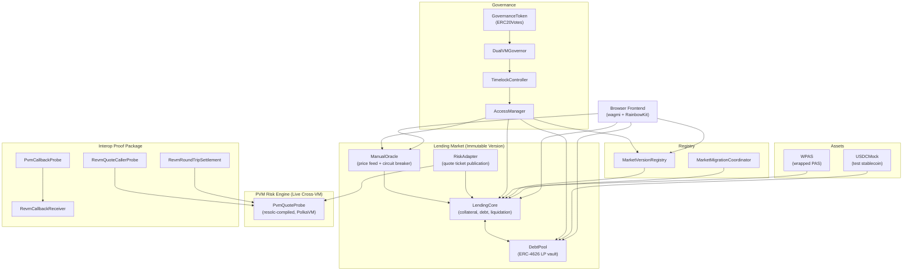

# DualVM Lending

A production-minded, public-testnet-validated isolated lending market on **Polkadot Hub TestNet**. DualVM Lending combines Solidity-based custody and accounting on REVM with a live PVM-compiled risk engine, OpenZeppelin Governor-based governance, and a full browser-based lending UX.

Built for the [Polkadot Solidity Hackathon 2026](https://dorahacks.io/) — targeting **all 3 prize tracks** simultaneously.

## Live Network

| Field | Value |
|-------|-------|
| Network | Polkadot Hub TestNet |
| Chain ID | `420420417` |
| ETH RPC | `https://eth-rpc-testnet.polkadot.io/` |
| Fallback RPC | `https://services.polkadothub-rpc.com/testnet/` |
| Explorer | [Blockscout](https://blockscout-testnet.polkadot.io/) |
| Faucet | [Polkadot Faucet](https://faucet.polkadot.io/) (Network: Polkadot testnet Paseo, Chain: Hub smart contracts) |

## Canonical Deployment (Governor-Governed)

All contracts deployed under a single canonical Governor→TimelockController→AccessManager governance root.

### Core Contracts

| Contract | Address | Explorer |
|----------|---------|----------|
| AccessManager | `0x32d0a9eb8F4Bd54F0610c31c277fD2E62e4ac2f0` | [Blockscout](https://blockscout-testnet.polkadot.io/address/0x32d0a9eb8F4Bd54F0610c31c277fD2E62e4ac2f0) |
| WPAS (Collateral) | `0x9b9e0c534E0Bfc938674238aFA44bCD1690F10F1` | [Blockscout](https://blockscout-testnet.polkadot.io/address/0x9b9e0c534E0Bfc938674238aFA44bCD1690F10F1) |
| USDCMock (Debt) | `0x75d47bd99ECd7188FB63e00cD07035CDBBf7Ef06` | [Blockscout](https://blockscout-testnet.polkadot.io/address/0x75d47bd99ECd7188FB63e00cD07035CDBBf7Ef06) |
| ManualOracle | `0x1CCE5059dc39A7cf8f064f6DA6Be9da09279Ee04` | [Blockscout](https://blockscout-testnet.polkadot.io/address/0x1CCE5059dc39A7cf8f064f6DA6Be9da09279Ee04) |
| RiskAdapter | `0x67D0B226b5aE56A29E206840Ecd389670718Af66` | [Blockscout](https://blockscout-testnet.polkadot.io/address/0x67D0B226b5aE56A29E206840Ecd389670718Af66) |
| PvmQuoteProbe (PVM Risk Engine) | `0x9a78F65b00E0AeD0830063eD0ea66a0B5d8876DE` | [Blockscout](https://blockscout-testnet.polkadot.io/address/0x9a78F65b00E0AeD0830063eD0ea66a0B5d8876DE) |
| MarketVersionRegistry | `0x47AE8aE7423bD8643Be8a86d4C0Df7fdcC57987d` | [Blockscout](https://blockscout-testnet.polkadot.io/address/0x47AE8aE7423bD8643Be8a86d4C0Df7fdcC57987d) |
| DebtPool (ERC-4626) | `0xeEdA5d44810E09D8F881Fca537456E2a5eD437bB` | [Blockscout](https://blockscout-testnet.polkadot.io/address/0xeEdA5d44810E09D8F881Fca537456E2a5eD437bB) |
| LendingCore | `0x9faC289188229f40aBfaa4F8d720C14b8B448CF9` | [Blockscout](https://blockscout-testnet.polkadot.io/address/0x9faC289188229f40aBfaa4F8d720C14b8B448CF9) |

### Governance Contracts

| Contract | Address | Explorer |
|----------|---------|----------|
| GovernanceToken (ERC20Votes) | `0x5C0201E6db2D4f1a97efeed09f4620A242116Bd1` | [Blockscout](https://blockscout-testnet.polkadot.io/address/0x5C0201E6db2D4f1a97efeed09f4620A242116Bd1) |
| DualVMGovernor | `0xa6d2c210f8A11F2D87b08efA8F832B4e64e521b3` | [Blockscout](https://blockscout-testnet.polkadot.io/address/0xa6d2c210f8A11F2D87b08efA8F832B4e64e521b3) |
| TimelockController | `0x65712EEFD810F077c6C11Fd7c18988d3ce569C60` | [Blockscout](https://blockscout-testnet.polkadot.io/address/0x65712EEFD810F077c6C11Fd7c18988d3ce569C60) |

### Probe Contracts (PVM Interop Proof)

| Contract | Address | Explorer |
|----------|---------|----------|
| PvmQuoteProbe (PVM) | `0x9a78F65b00E0AeD0830063eD0ea66a0B5d8876DE` | [Blockscout](https://blockscout-testnet.polkadot.io/address/0x9a78F65b00E0AeD0830063eD0ea66a0B5d8876DE) |
| PvmCallbackProbe (PVM) | `0xc60E223A91aEbf1589A5509F308b4787cF6607AE` | [Blockscout](https://blockscout-testnet.polkadot.io/address/0xc60E223A91aEbf1589A5509F308b4787cF6607AE) |
| RevmQuoteCallerProbe | `0xD08583e1AC7aCc75FF5365909Be808ea2AD5d942` | [Blockscout](https://blockscout-testnet.polkadot.io/address/0xD08583e1AC7aCc75FF5365909Be808ea2AD5d942) |
| RevmCallbackReceiver | `0x2b059760bb836128A287AE071167f9e3F4489c71` | [Blockscout](https://blockscout-testnet.polkadot.io/address/0x2b059760bb836128A287AE071167f9e3F4489c71) |
| RevmRoundTripSettlement | `0xB97286570473a5728669ee487BC05763E2f22fE1` | [Blockscout](https://blockscout-testnet.polkadot.io/address/0xB97286570473a5728669ee487BC05763E2f22fE1) |
| CrossChainQuoteEstimator (XCM) | `0x5bC4e5BbF72b67Acb202546e88849dAcF8985A7F` | [Blockscout](https://blockscout-testnet.polkadot.io/address/0x5bC4e5BbF72b67Acb202546e88849dAcF8985A7F) |

> 11 of 12 EVM-compiled contracts are explorer-verified on Blockscout. The PVM-compiled PvmQuoteProbe cannot be verified through standard Solidity verification (compiled via `resolc` for PolkaVM) — its PVM code hash `0xba8fe2...` is confirmed via `revive.accountInfoOf`.

## Live Proof TX Links

### Lending Operations
| Operation | TX Hash |
|-----------|---------|
| Borrow | [`0x5a9edd08...`](https://blockscout-testnet.polkadot.io/tx/0x5a9edd08efd8aec5e1ccbe0295b97e03cebc1b75588acf19a2738a109deba532) |
| Repay | [`0x02825742...`](https://blockscout-testnet.polkadot.io/tx/0x02825742b3d9cdc5e8c27b1ae30948d73885188c2e43a0de5c6105606c441dde) |
| Liquidation | [`0xeec68ce0...`](https://blockscout-testnet.polkadot.io/tx/0xeec68ce067523113520a888e9344860ea9d9421c135a6db6823da56ebe12048b) |

### PVM Interop Probes
| Stage | TX Hash |
|-------|---------|
| Echo (REVM→PVM→REVM) | [`0x282f3253...`](https://blockscout-testnet.polkadot.io/tx/0x282f32532f1bc337266e7a0d849edb1153449be7fad9d4b9feacec8aded641d0) |
| Quote (deterministic risk) | [`0x4f55eac1...`](https://blockscout-testnet.polkadot.io/tx/0x4f55eac1f75b6540e3d81d3618a8857574551809fce2b08bfc4e11a4b15b5698) |
| Roundtrip Settlement | [`0x4284ace5...`](https://blockscout-testnet.polkadot.io/tx/0x4284ace5171ead5bea7c5795ee78528ac815b5d65d450b6f85de06b56ebe2ad5) |

### Governance Operations
| Operation | TX Hash |
|-----------|---------|
| Version Activation | [`0x3278a9ee...`](https://blockscout-testnet.polkadot.io/tx/0x3278a9ee913be2f47907ae2921f8a1be2ec0d4525ee3b58e7092b1e2801a22eb) |
| Admin Renunciation | [`0x61c09d53...`](https://blockscout-testnet.polkadot.io/tx/0x61c09d5353c0d3c0246f818a413780517e7b7d5510022330fb822ac67c41e863) |

### Migration Proof
| Operation | TX Hash |
|-----------|---------|
| Migrate Borrower (v1→v2) | [`0x6d959dc9...`](https://blockscout-testnet.polkadot.io/tx/0x6d959dc9bc4ccf8ba2b815f6ad996ef5026f40e90c5e932542adfccaba45d78f) |
| Governance Proposal Execute | [`0x12fa628a...`](https://blockscout-testnet.polkadot.io/tx/0x12fa628ab6da2926f064af85ec9e97c59de6d6ebb72f502a83ce3f75a270e7e2) |

### XCM Precompile
| Operation | TX Hash |
|-----------|---------|
| weighMessage Proof | [`0xc147ac14...`](https://blockscout-testnet.polkadot.io/tx/0xc147ac140cc9591bcdd444478ed27d72ce4fd05312d5f8ef16f4e6dfe7439cc0) |

## Architecture



### How PVM Interop Works

The PVM risk engine is **live, not decorative**. Here is the proof chain:

1. **PvmQuoteProbe** is compiled via `resolc` (Polkadot's Solidity-to-PolkaVM compiler) and deployed on-chain with PVM code hash `0xba8fe2a621062a30bba558a3846d0a18bfb2e9a09bfaed656b123e698b59af5b`.
2. **RiskAdapter** in the product-path LendingCore calls this PVM contract as its quote engine for risk parameters (borrow rate, max LTV, liquidation threshold).
3. **Probe stages** independently prove the cross-VM capability:
   - **Echo**: REVM sends bytes32 to PVM, receives identical bytes back (data integrity)
   - **Quote**: REVM requests risk parameters from PVM, receives deterministic results (borrowRateBps=700, maxLtvBps=7500, liquidationThresholdBps=8500)
   - **Roundtrip Settlement**: REVM stores debt state derived from PVM-computed borrow rate (full REVM→PVM→REVM settlement)
4. **XCM Precompile**: CrossChainQuoteEstimator calls the XCM precompile at `0x...0a0000` for `weighMessage`, proving precompile awareness (refTime=979880000, proofSize=10943).

### Governance Architecture

The governance root follows the **Governor→TimelockController→AccessManager** pattern:

- **GovernanceToken**: ERC20 + ERC20Permit + ERC20Votes with timestamp-based CLOCK_MODE
- **DualVMGovernor**: Governor + GovernorCountingSimple + GovernorVotes + GovernorVotesQuorumFraction + GovernorTimelockControl
- **TimelockController**: Holds AccessManager admin role. Governor is the proposer.
- **AccessManager**: System-wide role management with non-zero execution delays (riskAdmin: 60s, treasury: 60s, minter: 60s, emergency: 0s)
- **Deployer has NO residual roles** — admin was renounced after setup.

Demo-friendly parameters: voting delay ~1s, voting period ~300s, timelock ~60s, quorum 4%.

## Bootstrap

```bash
cd dualvm
cp .env.example .env
# Fill PRIVATE_KEY for deploy/smoke commands (not needed for tests)
npm ci
npm test          # 81 local Hardhat tests
npx tsc --noEmit  # TypeScript typecheck
npm run build     # Compile contracts + PVM artifacts + frontend
```

## Demo Path

1. **Fund wallet**: Get PAS from the [faucet](https://faucet.polkadot.io/) (Network: Polkadot testnet Paseo, Chain: Hub smart contracts)
2. **Connect wallet**: Open the frontend, connect via RainbowKit to chain 420420417
3. **Supply liquidity**: Mint USDC-test (if minter) → approve → deposit to DebtPool
4. **Deposit collateral**: Wrap PAS → WPAS → approve → depositCollateral to LendingCore
5. **Borrow**: Enter amount → LendingCore.borrow() → receive USDC-test
6. **Repay**: Approve USDC-test → LendingCore.repay() → debt decreases
7. **Liquidate**: (If position is underwater) Enter borrower + amount → LendingCore.liquidate()
8. **Verify**: Check all transactions on [Blockscout](https://blockscout-testnet.polkadot.io/)

## Developer Commands

From `dualvm/`:

| Command | Description |
|---------|-------------|
| `npm test` | Run 81 Hardhat tests |
| `npm run build` | Compile contracts + PVM + frontend |
| `npx tsc --noEmit` | TypeScript typecheck |
| `npm run deploy:testnet` | Deploy to testnet |
| `npm run deploy:governed:testnet` | Deploy governed system |
| `npm run verify:testnet` | Explorer-verify contracts |
| `npm run build:pvm:probes` | Build PVM probe artifacts |
| `npm run deploy:pvm:probes:testnet` | Deploy PVM probes |

## Known Limitations

- **Single isolated market only** — no multi-market support
- **Manual oracle** — operator-controlled price feed with circuit breaker; not a decentralized oracle network
- **Hackathon governance parameters** — short voting/timelock periods for demo (not production values)
- **PVM callback probe (Stage 2)** — reverts on-chain due to platform-level cross-VM callback limitations; echo/quote/roundtrip probes all pass
- **PvmQuoteProbe not Blockscout-verifiable** — compiled via `resolc` for PolkaVM; PVM code hash confirmed via substrate API
- **USDC-test is a mock token** — not a real stablecoin; uses 18 decimals
- **Public RPC rate limiting** — frontend reads are conservative with caching

## Hackathon Tracks

| Track | Story |
|-------|-------|
| **Track 1: EVM Smart Contract** | Stablecoin-enabled DeFi lending market with deposit, borrow, repay, liquidation, ERC-4626 LP vault |
| **Track 2: PVM Smart Contract** | Live PVM risk engine (resolc-compiled), 4-stage REVM↔PVM interop proof, XCM precompile interaction |
| **OpenZeppelin Sponsor** | Non-trivial composition: AccessManager + Governor + TimelockController + ERC20Votes + ERC4626 + SafeERC20 + Pausable + ReentrancyGuard |

## Repository Structure

```
dualvm/                          # Application root
├── contracts/                   # Solidity contracts
│   ├── LendingCore.sol         # Immutable market version (collateral, debt, liquidation)
│   ├── DebtPool.sol            # ERC-4626 LP vault
│   ├── ManualOracle.sol        # Price feed with circuit breaker
│   ├── RiskAdapter.sol         # Quote ticket adapter
│   ├── governance/             # Governor + GovernanceToken
│   ├── precompiles/            # CrossChainQuoteEstimator (XCM)
│   └── probes/                 # PVM interop probe contracts
├── deployments/                # Canonical deployment manifests and results
├── lib/                        # TypeScript deployment and runtime helpers
├── scripts/                    # Operator and smoke-test scripts
├── src/                        # React frontend (wagmi + RainbowKit)
├── test/                       # Hardhat test suite (81 tests)
└── SPEC.md                     # Current system specification
docs/dualvm/                    # Proof artifacts and evidence
├── dualvm_vm_interop_proof.md  # PVM interop probe results with TX hashes
├── dualvm_governed_root_proof.md
├── dualvm_versioned_market_proof.md
├── dualvm_migration_format_proof.md
├── dualvm_quote_ticket_cutover_proof.md
├── screenshots/                # Visual evidence
└── submission_evidence/        # Submission artifacts
STATUS.md                       # Quick-reference deployment status
```

## Proof Artifacts

| Artifact | Location |
|----------|----------|
| Canonical manifest | `dualvm/deployments/polkadot-hub-testnet-canonical.json` |
| Deployment results | `dualvm/deployments/polkadot-hub-testnet-canonical-results.json` |
| Probe results | `dualvm/deployments/polkadot-hub-testnet-probe-results.json` |
| Explorer verification | `dualvm/deployments/polkadot-hub-testnet-canonical-verification.json` |
| Migration proof | `dualvm/deployments/polkadot-hub-testnet-migration-proof.json` |
| XCM proof | `dualvm/deployments/polkadot-hub-testnet-xcm-proof.json` |
| VM interop narrative | `docs/dualvm/dualvm_vm_interop_proof.md` |

## CI

`.github/workflows/ci.yml` runs `npm ci`, `npm test`, and `npm run build` in `dualvm/` on every push and pull request.
