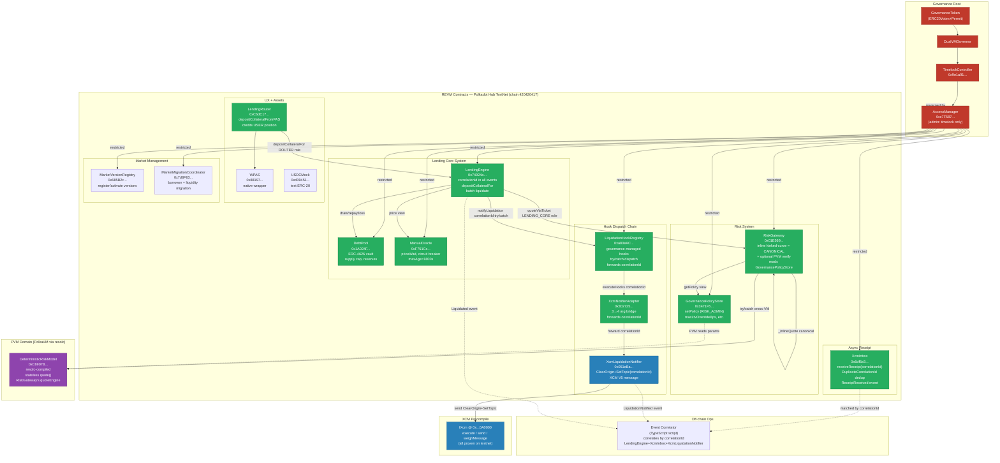
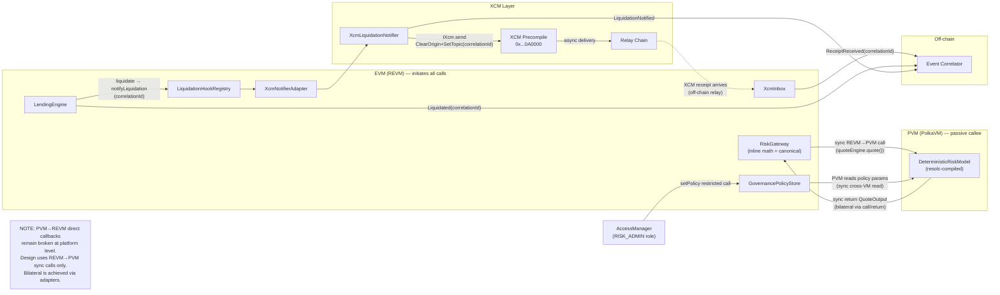
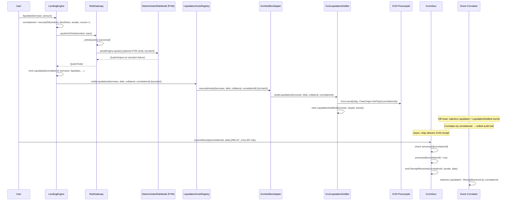
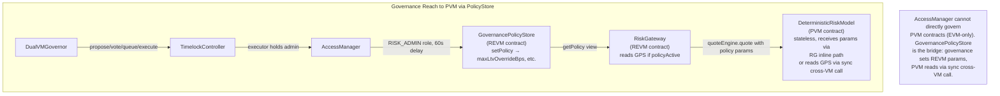
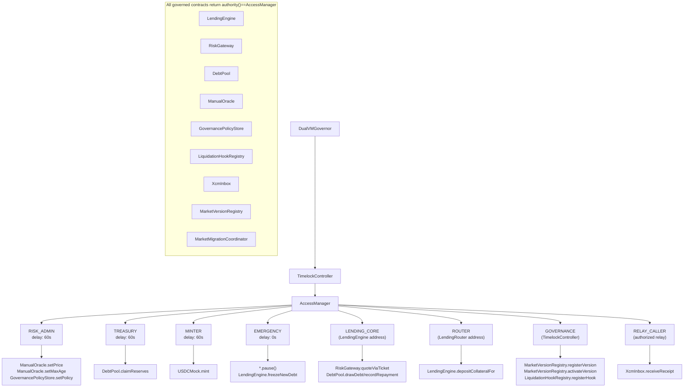
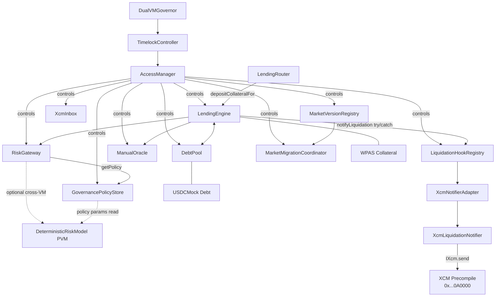

## DualVM Lending — M11 Bilateral Async Unified Architecture (Mermaid Diagrams)

All diagrams reflect the M11 `bilateral-async-unified` milestone state with canonical contract names,
correlationId event flows, GovernancePolicyStore, and AccessManager governance reach.

---

### System Overview (M11 Canonical)



---

### Bilateral Adapter Paths

The bilateral system uses adapters to bridge platform limitations:



---

### CorrelationId Event Flows



---

### GovernancePolicyStore in Diagram



---

### AccessManager Governance Reach



---

### Contract Dependency Graph (M11)



---

### ASCII System Board (M11)

```
╔══════════════════════════════════════════════════════════════════════════════════════════════════════════╗
║                       DualVM Lending — M11 Bilateral Async System Board (2026-03-19)                   ║
╠══════════════════════════════════════════════════════════════════════════════════════════════════════════╣
║                                                                                                        ║
║  ┌─────────────────────────────── FRONTEND (Vite + React 18) ────────────────────────────────────┐     ║
║  │  wagmi 2.19 + viem 2.37 + RainbowKit 2.2                                                      │     ║
║  │  TabNav: [Lend & Borrow | Market Data | Protocol Info]                                         │     ║
║  │  WritePathSection: deposit/borrow/repay/liquidate/supply/withdraw                              │     ║
║  │  ObserverSection: healthFactor (4-color), liquidationPrice, Max buttons                         │     ║
║  └────────────────────────────────────────────────────────────────────────────────────────────────┘     ║
║                           │ JSON-RPC (eth-rpc-testnet.polkadot.io)                                     ║
║                           ▼                                                                            ║
║  ┌──────────────────── POLKADOT HUB TESTNET (Chain 420420417) ──────────────────────────────────┐     ║
║  │                                                                                                │     ║
║  │   ┌──────────── REVM (EVM-compatible) ─────────────────────────────────────────────────┐      │     ║
║  │   │                                                                                     │      │     ║
║  │   │  ╔══════════════╗  ╔══════════════╗  ╔════════════════════╗                         │      │     ║
║  │   │  ║ AccessManager║  ║GovernorStack ║  ║ GovernancePolicyStore╗                       │      │     ║
║  │   │  ║ governs all  ║  ║Gov→TL→AM    ║  ║ setPolicy (RISK_ADMIN 60s)║                   │      │     ║
║  │   │  ║ REVM contracts║  ╚══════╤═══════╝  ║ maxLtvOverrideBps   ║                        │      │     ║
║  │   │  ╚══════╤════════╝         │           ╚══════╤══════════════╝                        │      │     ║
║  │   │         │                  └──────────────────┘                                      │      │     ║
║  │   │         ▼                                                                             │      │     ║
║  │   │  ╔═══════════════════╗  ◄── ManualOracle (maxAge=1800s, circuit breaker)             │      │     ║
║  │   │  ║   LendingEngine   ║                                                               │      │     ║
║  │   │  ║ borrow/repay/liq  ║────────────────────►╔══════════════════╗                     │      │     ║
║  │   │  ║ batch liquidate   ║                     ║   RiskGateway     ║                    │      │     ║
║  │   │  ║ depositCollateralFor║                   ║ INLINE kinked    ║                    │      │     ║
║  │   │  ║ correlationId events║                   ║ curve = CANONICAL║───► GovernancePolicyStore  │      │     ║
║  │   │  ╚═══════╤═════════╤═╝                     ║ + optional PVM   ║───► DeterministicRiskModel(PVM)  │      │     ║
║  │   │          │         │                        ╚══════════════════╝                    │      │     ║
║  │   │          │         ▼                                                                 │      │     ║
║  │   │          │  ╔══════════════════╗   ╔══════════════════╗                             │      │     ║
║  │   │          │  ║   DebtPool       ║   ║   LendingRouter  ║                            │      │     ║
║  │   │          │  ║ ERC-4626 vault   ║   ║ PAS→WPAS→        ║                            │      │     ║
║  │   │          │  ║ supply cap, resv ║   ║ depositCollateralFor║                          │      │     ║
║  │   │          │  ╚══════════════════╝   ║ (credits USER ✓) ║                            │      │     ║
║  │   │          │                          ╚══════════════════╝                            │      │     ║
║  │   │          │ correlationId                                                             │      │     ║
║  │   │          ▼                                                                           │      │     ║
║  │   │  ╔══════════════════════╗                                                           │      │     ║
║  │   │  ║ LiquidationHookRegistry║ ──► XcmNotifierAdapter ──► XcmLiquidationNotifier       │      │     ║
║  │   │  ║ try/catch dispatch   ║                            SetTopic(correlationId)          │      │     ║
║  │   │  ║ HookFailed non-block ║                            ──► XCM Precompile              │      │     ║
║  │   │  ╚══════════════════════╝                                                           │      │     ║
║  │   │                                                                                      │      │     ║
║  │   │  ╔══════════════════════╗                                                           │      │     ║
║  │   │  ║ XcmInbox             ║ receiveReceipt(correlationId)  ◄── off-chain relay        │      │     ║
║  │   │  ║ DuplicateCorrelation ║ ReceiptReceived event                                     │      │     ║
║  │   │  ║ dedup (processed map)║                                                           │      │     ║
║  │   │  ╚══════════════════════╝                                                           │      │     ║
║  │   └─────────────────────────────────────────────────────────────────────────────────────┘      │     ║
║  │                                                                                                │     ║
║  │   ┌──────────── PVM (PolkaVM / RISC-V) ─── deployed via resolc ─────────────────────────┐     │     ║
║  │   │                                                                                      │     │     ║
║  │   │  ╔══════════════════════╗                                                           │     │     ║
║  │   │  ║ DeterministicRiskModel║ ◄── resolc compiled, quoteEngine for RiskGateway         │     │     ║
║  │   │  ║ 0xC6907B609...       ║     Stage 1 EVM→PVM echo+quote ✓                         │     │     ║
║  │   │  ║ stateless quote()    ║     PVM→REVM callbacks: ✗ (platform level)               │     │     ║
║  │   │  ╚══════════════════════╝                                                           │     │     ║
║  │   └──────────────────────────────────────────────────────────────────────────────────────┘     │     ║
║  │                                                                                                │     ║
║  │   ┌──────────── OFF-CHAIN ─────────────────────────────────────────────────────────────┐      │     ║
║  │   │ Event Correlator (TypeScript)                                                       │      │     ║
║  │   │   watches: LendingEngine.Liquidated(correlationId)                                 │      │     ║
║  │   │   watches: XcmLiquidationNotifier.LiquidationNotified                              │      │     ║
║  │   │   watches: XcmInbox.ReceiptReceived(correlationId)                                 │      │     ║
║  │   │   correlates: by correlationId → unified audit trail (JSON)                        │      │     ║
║  │   └─────────────────────────────────────────────────────────────────────────────────────┘      │     ║
║  └────────────────────────────────────────────────────────────────────────────────────────────────┘     ║
║                                                                                                        ║
║  ┌──────────── M11 CANONICAL DEPLOYMENT ──────────────────────────────────────────────────────────┐    ║
║  │  Toolchain: Foundry (forge build, forge test, forge script) — Hardhat fully removed             │    ║
║  │  Tests: 291 Foundry tests pass (18 *.t.sol files)                                               │    ║
║  │  Canonical manifest: deployments/polkadot-hub-testnet-m11-canonical.json                        │    ║
║  │  Governance: DualVMGovernor→TimelockController→AccessManager, deployer has NO admin             │    ║
║  │  Key addresses:                                                                                  │    ║
║  │    LendingEngine:           0x74924a4502f666023510ED21Ae6E27bC47eE6485                          │    ║
║  │    RiskGateway:             0x01E56920355f1936c28A2EA627D027E35EccBca6                          │    ║
║  │    GovernancePolicyStore:   0x3471F542f66603a1899947fE5849a612f0A7f465                          │    ║
║  │    LendingRouter:           0xC6dC173de67FF347c864d4F26a96c5e725099394                          │    ║
║  │    LiquidationHookRegistry: 0xa80eAC309424FD3FA0daaF7200F5c2ab2bcb9B9A                          │    ║
║  │    XcmInbox:                0x6df5e3694976fd46Df67b1E6A7BdE85B39271719                          │    ║
║  │    AccessManager:           0xc7F5871c0223eE42A858b54a679364c92C8CB0E8                          │    ║
║  │    DebtPool:                0x1A024F0232Bab9D6282Efbf533F11e11511d68a8                          │    ║
║  └────────────────────────────────────────────────────────────────────────────────────────────────┘    ║
╚══════════════════════════════════════════════════════════════════════════════════════════════════════════╝
```
