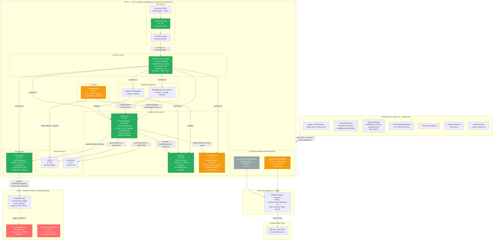

```mermaid
graph TB
    subgraph FRONTEND["Frontend (Vite + React 18 + wagmi/viem)"]
        direction TB
        UI_TABS["TabNav: Lend&Borrow | Market Data | Protocol Info"]
        WRITE["WritePathSection<br/>deposit/borrow/repay<br/>liquidate/supply/withdraw"]
        OBSERVER["ObserverSection<br/>HealthFactor (4-color)<br/>LiquidationPrice<br/>Max buttons"]
        SNAPSHOT["CompactMarketSnapshot<br/>TVL | Utilization | Price"]
        TXHIST["TxHistoryList (global)"]
        READLAYER["ReadLayerSection<br/>Pool metrics"]
        MANIFEST["ManifestSection<br/>Contract addresses"]
    end

    subgraph REVM["REVM — EVM Compatible (Polkadot Hub TestNet chain 420420417)"]
        direction TB

        subgraph CORE["Lending Core System"]
            direction LR
            LC["LendingCore<br/>772 LOC<br/>AccessManaged + Pausable<br/>+ ReentrancyGuard<br/>borrow / repay / liquidate<br/>batchLiquidate<br/>depositCollateral<br/>withdrawCollateral"]
            DP["DebtPool<br/>204 LOC<br/>ERC-4626 Vault<br/>supplyCap, reserves<br/>drawDebt / recordRepayment<br/>recordLoss"]
            MO["ManualOracle<br/>163 LOC<br/>AccessManaged + Pausable<br/>setPrice / circuit breaker<br/>maxAge=21600s ⚠<br/>epoch tracking"]
        end

        subgraph RISK["Risk Engine"]
            direction LR
            RA["RiskAdapter<br/>253 LOC<br/>AccessManaged<br/>INLINE kinked-curve = CANONICAL<br/>+ optional PVM verify<br/>QuoteTicket caching"]
        end

        subgraph ASSETS["Asset Contracts"]
            direction LR
            WPAS["WPAS<br/>41 LOC<br/>Native wrapper"]
            USDC["USDCMock<br/>17 LOC<br/>Test ERC-20"]
        end

        subgraph GOV["Governance"]
            direction LR
            GT["GovernanceToken<br/>ERC20Votes + Permit"]
            GOV_C["DualVMGovernor<br/>100 LOC<br/>OZ Governor suite"]
            TL["TimelockController<br/>Execution delays"]
        end

        subgraph MGMT["Market Management"]
            direction LR
            MVR["MarketVersionRegistry<br/>register / activate"]
            MMC["MarketMigrationCoordinator<br/>borrower + liquidity migration"]
        end

        subgraph ACCESS["Access Control"]
            AM["DualVMAccessManager<br/>OZ AccessManager<br/>EMERGENCY: 0s delay<br/>RISK_ADMIN: 60s<br/>TREASURY: 60s<br/>LENDING_CORE: role 7"]
        end

        subgraph ROUTER["UX Helper"]
            LR_C["LendingRouter<br/>64 LOC<br/>PAS→WPAS→deposit<br/>⚠ Credits SELF not USER"]
        end

        subgraph XCM_CONTRACTS["XCM Demonstration (STANDALONE)"]
            direction LR
            CCQE["CrossChainQuoteEstimator<br/>weighMessage ✓<br/>execute ✓<br/>send ✓"]
            XLN["XcmLiquidationNotifier<br/>send() V5 ClearOrigin<br/>⚠ NOT called by LendingCore"]
        end
    end

    subgraph PVM["PVM — PolkaVM / RISC-V (Preview Release)"]
        direction TB
        PQP["PvmQuoteProbe<br/>(=quoteEngine target)<br/>resolc compiled<br/>Stage 1: EVM→PVM ✓"]
        PCP["PvmCallbackProbe<br/>deployed but<br/>Stage 2: PVM→EVM ✗ BROKEN"]
        DRM["DeterministicRiskModel<br/>87 LOC<br/>⚠ EXISTS as .sol<br/>NOT compiled to PVM"]
    end

    subgraph PRECOMPILE["XCM Precompile @ 0x...A0000"]
        XCM_PC["weighMessage() ✓<br/>execute() ✓<br/>send() ✓<br/>All proven with ClearOrigin V5<br/>dest: 0x050100 (relay parent)"]
    end

    subgraph RELAY["Polkadot Relay Chain"]
        RC["Receives ClearOrigin<br/>No actionable data ⚠"]
    end

    %% Frontend → Chain
    FRONTEND -->|"JSON-RPC via eth-rpc-testnet.polkadot.io"| REVM

    %% Core lending flow
    LC -->|"latestPriceWad / isFresh / epoch"| MO
    LC -->|"quoteViaTicket (restricted)"| RA
    LC -->|"drawDebt / recordRepayment / recordLoss"| DP
    LC -->|"safeTransferFrom / safeTransfer"| WPAS
    LC -->|"safeTransferFrom / safeTransfer"| USDC

    %% Risk flow
    RA -->|"optional: quoteEngine.quote()<br/>try/catch (non-blocking)"| PQP

    %% Access control
    AM -->|"authority for"| LC
    AM -->|"authority for"| RA
    AM -->|"authority for"| DP
    AM -->|"authority for"| MO
    AM -->|"authority for"| MVR
    AM -->|"authority for"| MMC

    %% Governance
    GT --> GOV_C
    GOV_C --> TL
    TL -->|"executor for AccessManager"| AM

    %% Market management
    MVR -->|"validates"| LC
    MVR -->|"validates"| DP
    MMC -->|"exportPosition / importPosition"| LC

    %% Router
    LR_C -->|"WPAS.deposit + approve"| WPAS
    LR_C -->|"depositCollateral (msg.sender=router ⚠)"| LC

    %% XCM (standalone)
    CCQE --> XCM_PC
    XLN --> XCM_PC
    XCM_PC -->|"send to relay"| RC

    %% PVM cross-VM
    PQP -.->|"Stage 2 callback ✗"| PCP

    %% Styling
    classDef broken fill:#ff6b6b,stroke:#c0392b,color:#fff
    classDef warning fill:#f39c12,stroke:#e67e22,color:#fff
    classDef good fill:#27ae60,stroke:#1e8449,color:#fff
    classDef standalone fill:#95a5a6,stroke:#7f8c8d,color:#fff

    class PCP broken
    class DRM broken
    class LR_C warning
    class MO warning
    class XLN warning
    class CCQE standalone
    class LC good
    class DP good
    class RA good
    class AM good
    class GOV_C good
```
