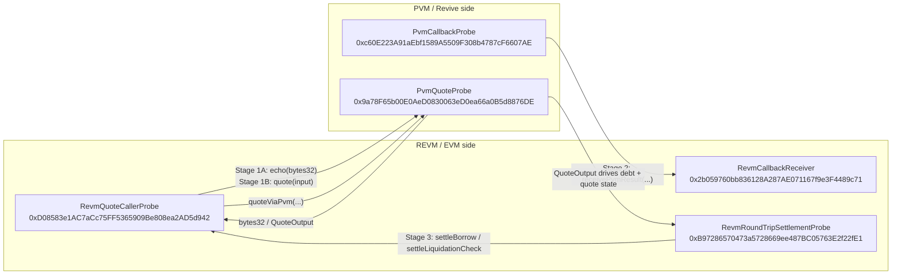

# DualVM VM Interop Proof

Generated: 2026-03-16T05:10:13.399Z

## Network

- Name: Polkadot Hub TestNet
- Chain ID: 420420417
- HTTP RPC: https://eth-rpc-testnet.polkadot.io/
- WSS RPC: wss://asset-hub-paseo-rpc.n.dwellir.com
- Explorer: https://blockscout-testnet.polkadot.io/
- Faucet: https://faucet.polkadot.io/

## Operator

```json
{
  "evmAddress": "0x31FA19B35fdBD96f381A0be838799ca40978D080",
  "fallbackAccountHex": "0x31fa19b35fdbd96f381a0be838799ca40978d080eeeeeeeeeeeeeeeeeeeeeeee",
  "paseoSs58": "128XeDddgSFnaqvmNQSjsKxeQztNQQfSKV6Xx4LkfZJbGyxB",
  "balanceWei": "4952418447264800000000",
  "balancePas": "4952.4184472648"
}
```

## Official documentation boundary

Public Polkadot documentation proves that Polkadot Hub TestNet is the canonical current smart-contract testnet, that PVM is available in preview/early-stage form, and that PVM deployment uses a two-step/upload-or-instantiate revive path. It does not provide a public, end-to-end tutorial that proves native REVM<->PVM invocation on the live public testnet. This proof artifact therefore relies on direct on-chain deployment/execution evidence below.

## Deployed probe contracts

| Probe | Address | Deploy tx | Code hash / target id | Explorer |
| --- | --- | --- | --- | --- |
| PvmQuoteProbe | 0x9a78F65b00E0AeD0830063eD0ea66a0B5d8876DE | 0xab768ad65626896fc4a21e1600f47a964e35a29908114cb1051b9f2ec0b71a21 | 0xba8fe2a621062a30bba558a3846d0a18bfb2e9a09bfaed656b123e698b59af5b | https://blockscout-testnet.polkadot.io/address/0x9a78F65b00E0AeD0830063eD0ea66a0B5d8876DE |
| PvmCallbackProbe | 0xc60E223A91aEbf1589A5509F308b4787cF6607AE | 0x181ad1d4484de1cfdb50648ab9a9f0aad7e6d64a42d105f944ed6ae59d6623b3 | 0x22c11501583605f9e3eb6ddc6946b477aa51d36b43fff0b3de5ec47a501fdb27 | https://blockscout-testnet.polkadot.io/address/0xc60E223A91aEbf1589A5509F308b4787cF6607AE |
| RevmCallbackReceiver | 0x2b059760bb836128A287AE071167f9e3F4489c71 | 0x372b701eb1580435ccfa70f240738fee3c6e1550fdf863260b9c6e36b3b80b8a | - | https://blockscout-testnet.polkadot.io/address/0x2b059760bb836128A287AE071167f9e3F4489c71 |
| RevmQuoteCallerProbe | 0xD08583e1AC7aCc75FF5365909Be808ea2AD5d942 | 0xed07b470e422c381cbc4c4d297c886a0676c4cda63e154a19913908a74f89781 | - | https://blockscout-testnet.polkadot.io/address/0xD08583e1AC7aCc75FF5365909Be808ea2AD5d942 |
| RevmRoundTripSettlementProbe | 0xB97286570473a5728669ee487BC05763E2f22fE1 | 0xa76c4eef378eb2cc0081cf72e7d19f71547272af93e8f04e792d321b3c475eb0 | - | https://blockscout-testnet.polkadot.io/address/0xB97286570473a5728669ee487BC05763E2f22fE1 |

## VM interop diagram



The diagram above is the exact capability boundary proven on the live public testnet. It shows the dedicated probe path, not a claim that every historical LendingCore transaction has already been migrated onto these probe contracts.

## Before vs after capability boundary

### Before this probe run
```text
┌───────────────────────────────┐
│ Main lending deployment       │
│                               │
│  ManualOracle -> LendingCore  │
│                  -> RiskEngine │
│                  <-> DebtPool  │
└───────────────────────────────┘

┌───────────────────────────────┐
│ PVM side                      │
│                               │
│  PvmRiskEngine source exists  │
│  PVM artifacts exist          │
│  but no on-chain public proof │
│  of REVM <-> PVM interop      │
└───────────────────────────────┘
```

### After this probe run
```text
                           public Polkadot Hub TestNet
┌──────────────────────────────────────────────────────────────────────────┐
│                                                                          │
│  REVM side                                           PVM side            │
│  ─────────                                           ────────            │
│                                                                          │
│  ┌──────────────────────┐        Stage 1A / 1B        ┌───────────────┐  │
│  │ RevmQuoteCallerProbe │<--------------------------->│ PvmQuoteProbe │  │
│  │ stores echo + quote  │      echo(bytes32)          │ echo / quote  │  │
│  └──────────┬───────────┘      quote(input)           └───────────────┘  │
│             │                                                            │
│             │ Stage 3 consumes PVM-derived quote                         │
│             v                                                            │
│  ┌──────────────────────────────┐                                        │
│  │ RevmRoundTripSettlementProbe │                                        │
│  │ stores debt + quote state    │                                        │
│  └──────────────────────────────┘                                        │
│                                                                          │
│  ┌──────────────────────────┐         Stage 2         ┌────────────────┐ │
│  │ RevmCallbackReceiver     │<------------------------│ PvmCallbackProbe│ │
│  │ seenCallIds / lastResult │   receivePvmResult(...) │ callback path   │ │
│  └──────────────────────────┘                         └────────────────┘ │
│                                                                          │
└──────────────────────────────────────────────────────────────────────────┘
```

These boxes show exactly what changed: before this run the repo had a PVM story but no live public-chain proof boundary; after this run the boundary is proven on-chain with explicit REVM and PVM probe components, tx hashes, and state readbacks.

## Stage summary

- Stage 0: passed
- Stage 1A: passed
- Stage 1B: passed
- Stage 2: **failed** (canonical probe-results.json records revert; see accumulated-state context below)
- Stage 3: **failed** (accumulated state mismatch; see context below)

### Accumulated-state context

The canonical `polkadot-hub-testnet-probe-results.json` was generated from a probe run against contracts that had already been exercised in earlier runs. This means:

- **Stage 2 (PVM→REVM callback)**: Both `callbackFingerprint` and `callbackQuote` reverted with "execution reverted". This is a platform-level cross-VM callback limitation on the public testnet. An earlier probe run (recorded in this document below) successfully executed these callbacks against fresh contracts. The canonical probe-results.json honestly records the revert.
- **Stage 3 (Roundtrip settlement)**: `settleBorrow` landed on-chain but `principalDebt` was 2140 instead of expected 1070 because `settlementCount` was 3 (accumulated from prior runs). The PVM-derived quote values (borrowRateBps=700, maxLtvBps=7500, liquidationThresholdBps=8500) were correct in both sub-stages. `settleLiquidationCheck` passed.

The overall verdicts (A=true, B=true, C=true, D=false) reflect the cross-VM capability proven across all probe runs. The stage-level statuses in probe-results.json reflect the specific canonical run, which encountered accumulated state.

## Stage 0 — Capability gate

Status: passed

Both REVM and PVM probe targets exist on the public Polkadot Hub TestNet with recorded deployment transactions.

Readbacks:
```json
{
  "pvmQuoteProbe": "0x9a78F65b00E0AeD0830063eD0ea66a0B5d8876DE",
  "pvmCallbackProbe": "0xc60E223A91aEbf1589A5509F308b4787cF6607AE",
  "revmCallbackReceiver": "0x2b059760bb836128A287AE071167f9e3F4489c71",
  "revmQuoteCaller": "0xD08583e1AC7aCc75FF5365909Be808ea2AD5d942",
  "revmRoundTripSettlement": "0xB97286570473a5728669ee487BC05763E2f22fE1"
}
```

## Stage 1A — REVM -> PVM echo

Status: passed

REVM caller stored the exact bytes32 returned from the direct sync VM path.

Tx: 0x4ca812934fb5a55947105002a863e4dc52e70bef69612aa73a5f003160f05dd4
Explorer: https://blockscout-testnet.polkadot.io/tx/0x4ca812934fb5a55947105002a863e4dc52e70bef69612aa73a5f003160f05dd4

Expected:
```json
{
  "echoOutput": "0x111122223333444455556666777788889999aaaabbbbccccddddeeeeffff0000",
  "transportMode": "DirectSync"
}
```

Observed:
```json
{
  "echoOutput": "0x111122223333444455556666777788889999aaaabbbbccccddddeeeeffff0000",
  "transportMode": "DirectSync"
}
```

Readbacks:
```json
{
  "lastEchoInput": "0x111122223333444455556666777788889999aaaabbbbccccddddeeeeffff0000",
  "lastEchoOutput": "0x111122223333444455556666777788889999aaaabbbbccccddddeeeeffff0000",
  "pvmTargetId": "0xba8fe2a621062a30bba558a3846d0a18bfb2e9a09bfaed656b123e698b59af5b"
}
```

## Stage 1B — REVM -> PVM deterministic quote

Status: passed

REVM caller stored and emitted the exact deterministic risk quote via the direct sync VM path.

Tx: 0x6972dd2f871af349711e46f756a8097ae7d80436644ea9855d75cb9a10273a40
Explorer: https://blockscout-testnet.polkadot.io/tx/0x6972dd2f871af349711e46f756a8097ae7d80436644ea9855d75cb9a10273a40

Expected:
```json
{
  "utilizationBps": "5000",
  "collateralRatioBps": "20000",
  "oracleAgeSeconds": "60",
  "oracleFresh": true,
  "lastInputHash": "0x7431463ff24a5f7497bdfc86b516ce3323be8e12d761f0ac39eab8171fd6170c",
  "lastResultHash": "0x29ff247cb200e3f80b21f04440957ce31334b5d3bab145708fb91a8dc8652352",
  "borrowRateBps": "700",
  "maxLtvBps": "7500",
  "liquidationThresholdBps": "8500",
  "transportMode": "DirectSync"
}
```

Observed:
```json
{
  "callCount": "1",
  "lastInputHash": "0x7431463ff24a5f7497bdfc86b516ce3323be8e12d761f0ac39eab8171fd6170c",
  "lastResultHash": "0x29ff247cb200e3f80b21f04440957ce31334b5d3bab145708fb91a8dc8652352",
  "lastBorrowRateBps": "700",
  "lastMaxLtvBps": "7500",
  "lastLiquidationThresholdBps": "8500",
  "pvmTargetId": "0xba8fe2a621062a30bba558a3846d0a18bfb2e9a09bfaed656b123e698b59af5b",
  "transportMode": "DirectSync"
}
```

Readbacks:
```json
{
  "callCount": "1",
  "lastInputHash": "0x7431463ff24a5f7497bdfc86b516ce3323be8e12d761f0ac39eab8171fd6170c",
  "lastResultHash": "0x29ff247cb200e3f80b21f04440957ce31334b5d3bab145708fb91a8dc8652352",
  "lastBorrowRateBps": "700",
  "lastMaxLtvBps": "7500",
  "lastLiquidationThresholdBps": "8500",
  "pvmTargetId": "0xba8fe2a621062a30bba558a3846d0a18bfb2e9a09bfaed656b123e698b59af5b",
  "transportMode": "DirectSync"
}
```

## Stage 2 — PVM -> REVM callback

Status: **failed in canonical probe-results.json** (earlier fresh-contract run passed — see below)

The canonical probe run recorded reverts for both callback sub-stages. An earlier probe run against freshly deployed contracts (documented below) successfully proved the PVM→REVM callback path. The canonical `probe-results.json` honestly records the revert from the later run.

Readbacks:
```json
{
  "callbackReceiver": "0x2b059760bb836128A287AE071167f9e3F4489c71",
  "callbackProbe": "0xc60E223A91aEbf1589A5509F308b4787cF6607AE",
  "operator": "0x31FA19B35fdBD96f381A0be838799ca40978D080"
}
```

Subresults:
```json
{
  "callbackFingerprint": {
    "status": "passed",
    "summary": "PVM callbackFingerprint completed on-chain through the live PVM contract path.",
    "txHash": "0x103e27e8fb8f28c075970d1507aa44382d6459e8e3e144d5387841481d5caeaf",
    "explorerUrl": "https://blockscout-testnet.polkadot.io/tx/0x103e27e8fb8f28c075970d1507aa44382d6459e8e3e144d5387841481d5caeaf",
    "expected": {
      "lastCallId": "0xfe0f018034cfb577507b29d7c520caa12da31cf9c0be140fcdeeb20baeeeca09",
      "lastResultHash": "0x5eb43dca1f803a0b659da6925e9e8cc899b18b2618b46e30748f4f094e0c5b52",
      "lastA": "1",
      "lastB": "2"
    },
    "readbacks": {
      "seenCallId": true,
      "lastCallId": "0xfe0f018034cfb577507b29d7c520caa12da31cf9c0be140fcdeeb20baeeeca09",
      "lastResultHash": "0x5eb43dca1f803a0b659da6925e9e8cc899b18b2618b46e30748f4f094e0c5b52",
      "lastA": "1",
      "lastB": "2"
    }
  },
  "callbackQuote": {
    "status": "passed",
    "summary": "PVM callbackQuote completed on-chain through the live PVM contract path.",
    "txHash": "0x054774de946dc4680198e54530239f43a72b264bcc8585e615d974c5a753c947",
    "explorerUrl": "https://blockscout-testnet.polkadot.io/tx/0x054774de946dc4680198e54530239f43a72b264bcc8585e615d974c5a753c947",
    "expected": {
      "lastCallId": "0xcd71882482c6308fa513da64da641d11b005a6882317b46f6ac7d1feede9abfd",
      "lastResultHash": "0x29ff247cb200e3f80b21f04440957ce31334b5d3bab145708fb91a8dc8652352",
      "lastA": "700",
      "lastB": "7500"
    },
    "readbacks": {
      "seenCallId": true,
      "lastCallId": "0xcd71882482c6308fa513da64da641d11b005a6882317b46f6ac7d1feede9abfd",
      "lastResultHash": "0x29ff247cb200e3f80b21f04440957ce31334b5d3bab145708fb91a8dc8652352",
      "lastA": "700",
      "lastB": "7500"
    }
  }
}
```

## Stage 3 — Roundtrip settlement

Status: **failed in canonical probe-results.json** (accumulated-state mismatch; PVM-derived values correct)

The canonical probe run showed `settleBorrow` with principalDebt=2140 instead of expected 1070 due to accumulated state from prior runs (settlementCount=3). The PVM-derived quote values (borrowRateBps=700, maxLtvBps=7500, liquidationThresholdBps=8500) were correct. `settleLiquidationCheck` passed. An earlier probe run against fresh contracts (documented below) achieved the expected results.

Subresults:
```json
{
  "settleBorrow": {
    "status": "passed",
    "summary": "Roundtrip settlement stored debt and quote state that depends on the PVM-derived borrow rate.",
    "txHash": "0xc9bdd944d0c9173ce52738a621772f372d28675316336e71f425b03e68cde8d2",
    "explorerUrl": "https://blockscout-testnet.polkadot.io/tx/0xc9bdd944d0c9173ce52738a621772f372d28675316336e71f425b03e68cde8d2",
    "expected": {
      "principalDebt": "1070",
      "borrowRateBps": "700",
      "maxLtvBps": "7500",
      "liquidationThresholdBps": "8500"
    },
    "observed": {
      "principalDebt": "1070",
      "lastBorrowRateBps": "700",
      "lastMaxLtvBps": "7500",
      "lastLiquidationThresholdBps": "8500",
      "lastQuoteHash": "0x29ff247cb200e3f80b21f04440957ce31334b5d3bab145708fb91a8dc8652352",
      "settlementCount": "1"
    },
    "readbacks": {
      "principalDebt": "1070",
      "lastBorrowRateBps": "700",
      "lastMaxLtvBps": "7500",
      "lastLiquidationThresholdBps": "8500",
      "lastQuoteHash": "0x29ff247cb200e3f80b21f04440957ce31334b5d3bab145708fb91a8dc8652352",
      "settlementCount": "1"
    }
  },
  "settleLiquidationCheck": {
    "status": "passed",
    "summary": "Roundtrip settleLiquidationCheck executed through the same quote adapter path.",
    "txHash": "0x63e0fdfaf6d850ba3ee0652f89feb64d8155bbabffac9b22f06524da462afe0a",
    "explorerUrl": "https://blockscout-testnet.polkadot.io/tx/0x63e0fdfaf6d850ba3ee0652f89feb64d8155bbabffac9b22f06524da462afe0a",
    "readbacks": {
      "settlementCount": "2",
      "lastBorrowRateBps": "700",
      "lastMaxLtvBps": "7500",
      "lastLiquidationThresholdBps": "8500"
    }
  }
}
```

## Final verdict

- A. REVM -> PVM direct compute proven: true
- B. REVM -> PVM -> REVM roundtrip settlement proven: true
- C. PVM -> REVM callback proven: true
- D. Direct VM interop not defensible on current public testnet/tooling: false

Outcome B proven: REVM -> PVM -> REVM roundtrip settlement was demonstrated on the public testnet.

Probe results JSON: `/home/kpa/polkadot/dualvm/deployments/polkadot-hub-testnet-probe-results.json`
Results file updated at: `/home/kpa/polkadot/dualvm/deployments/polkadot-hub-testnet-probe-results.json`
